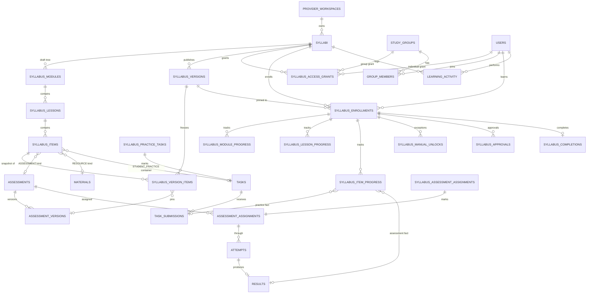

# Syllabus / Structured Learning Architecture — analysis, design and plan

Status: **approved by the owner** (all 12 recommended defaults, with one change to Q7 — see §15). **Phase 1 (database + backend) implemented** behind the `SYLLABUS` feature flag — see §16. Phase 2 (teacher builder UI) is next.
Spec: [`docs/specs/SYLLABUS-SPEC.md`](specs/SYLLABUS-SPEC.md) (the owner's 45-section specification, Azerbaijani).
Baseline analysed: `main` at `fc649af` (migrations up to `0025_task_answer_keys`).

---

## 0. Qısa xülasə (AZ)

- **Materiallar toxunulmaz qalır.** Syllabus ayrıca modul kimi qurulur; Material dərsə yalnız *istinad* (reference) kimi əlavə olunur, `materials` cədvəli və səhifələri dəyişmir.
- **Mövcud sistemlər təkrar istifadə olunur:** imtahanlar üçün mövcud Assessment mühərriki (versiyalar, cəhdlər, nəticələr), tələbə praktikası üçün mövcud Tapşırıq sistemi (təslim, AI yoxlama, gizli cavab açarı), qruplar, bildirişlər, fayl saxlama.
- **Yeni olan:** Syllabus → Modul → Dərs → Dərs elementləri (Nəzəriyyə / Müəllim praktikası / Tələbə praktikası / Qiymətləndirmə / Resurs), versiyalar, giriş icazələri, irəliləyiş cədvəlləri, əl ilə açma (audit ilə), fəaliyyət jurnalı, sertifikata hazır tamamlanma qeydi.
- **Versiyalama:** müəllim həmişə "qaralama" üzərində işləyir; "Dərc et" düyməsi dəyişməz (immutable) versiya yaradır (v1.0, v1.1…). Hər tələbə öz versiyasına bağlıdır — müəllimin sonrakı dəyişikliyi başlamış tələbələrin irəliləyişini pozmur.
- **İrəliləyiş məntiqi:** qaydalar (nəzəriyyə, praktika, imtahan keçid balı, təkrar cəhd, müəllim təsdiqi) Syllabus → Modul → Dərs səviyyəsində konfiqurasiya olunur və irsən keçir. Server hər hadisədən sonra tələbənin vəziyyətini yenidən hesablayır; kilidli məzmun serverdən heç vaxt göndərilmir.
- **Qrup yoldaşlarının irəliləyişi (Q7, təsdiqlənib):** tələbələr qrup yoldaşlarının syllabus irəliləyişini görür; müəllim bunu hər qrup üçün yeni "İrəliləyiş qrupda görünsün" ayarı ilə bağlaya bilər (default AÇIQ). Yalnız irəliləyiş göstərilir — cavablar, rəylər, ballar heç vaxt.
- **Analitika:** əvvəlcə real vaxtda SQL ilə irəliləyiş cədvəllərindən (sürətli və dəqiq); yalnız lazım olarsa sonradan gündəlik yığım (rollup) cədvəlləri. Risk qrupu və "insight"-lar sadə qaydalarla.
- **Təhlükəsizlik yayımı:** bütün miqrasiyalar yalnız yeni cədvəl əlavə edir (ADD-ONLY), mövcud cədvəllərə sütun əlavə olunmur; kod miqrasiya işləməyibsə də çökmür; funksiya bayraq (feature flag) ilə əvvəl pilot workspace-də açılır.

---

## 1. Current architecture

### 1.1 Stack and layout

| Layer | Where | Notes |
|---|---|---|
| Client | `client/src` — React + Vite SPA, `wouter` routing (`client/src/App.tsx`), tRPC React Query client (`client/src/lib/trpc.ts`), shadcn/Radix UI (`client/src/components/ui/*`), `recharts` for charts, `streamdown` (markdown renderer, used by `AIChatBox.tsx`) | i18n AZ/EN/RU via `client/src/i18n/catalog/*.ts` merged in `catalog/index.ts` (one file per domain; the i18n test forbids duplicate keys) |
| Server | `server/_core/index.ts` (Express bootstrap), `server/routers.ts` (single tRPC `appRouter`), `server/modules/*` (domain logic), `server/notifications/*` (dispatcher), `server/adminRouter.ts` | Background jobs are in-process `setInterval`s: attempt sweeper (`_core/index.ts`, 30 s), notification worker (`notifications/dispatcher.ts`) |
| DB | MySQL + Drizzle, schema in `drizzle/schema.ts`, SQL migrations `drizzle/0000…0025_*.sql` with `drizzle/meta/_journal.json` + snapshots; `pnpm db:verify` (`scripts/verify-migrations.cjs`) checks journal/snapshot consistency | Railway does **not** run migrations automatically (`RAILWAY.md` step 4: `pnpm db:migrate` by hand) |
| Files | `files` table, base64 in `longtext` (`server/modules/files.ts`, `MAX_FILE_BYTES = 8 MB`, allow-list: office docs, pdf, csv, txt, png, jpg — **no video**) served by `GET /api/files/:id` (`server/_core/files.ts`) | `server/storage.ts` (S3 via Manus Forge) exists from the template but is not wired to app files |
| Tests | Unit: `server/*.test.ts` (vitest); DB integration: `server/integration/*.it.ts` (`pnpm test:db`) | Pure logic is kept in testable modules (e.g. `server/modules/engine.ts`, `motivation.ts`) |

### 1.2 Auth and authorization

- Sign-in: Google OAuth (`server/_core/googleAuth.ts`) and email + password (`server/modules/passwordAuth.ts`, scrypt in `_core/password.ts`); session cookie issued by `_core/authSession.ts`; CSRF guard (`_core/csrf.ts`); per-procedure rate limits (`rateLimit(...)` in `_core/trpc.ts`).
- **Users carry no role.** Capabilities are derived per request (`server/modules/access.ts → resolveAccess`):
  - *teaching* = the user **owns** a `provider_workspaces` row (`ownerUserId`). There is **no co-teacher / workspace-member table** today.
  - *learning* = the user has an ACTIVE (or PENDING) `group_members` row.
  - *partner* = auto-provisioned `partner_profiles`.
  - *admin* = `platform_roles` (`SUPER_ADMIN`, `SUPPORT_ADMIN`, …) mapped to permissions in `shared/adminPermissions.ts`; SUPER_ADMIN also requires the e-mail allow-list.
- tRPC procedures (`server/_core/trpc.ts`): `publicProcedure`, `protectedProcedure` (signed in, not suspended), `teacherProcedure` (resolves the workspace from the `WORKSPACE_HEADER` and **verifies ownership**, exposing `ctx.scope = { workspaceId, userId }`), `studentProcedure` (= protected; resource access checked inside modules), `adminProcedure(permission)`.
- Every teacher module call is scope-checked (`assertGroupOwner`, `assignmentOf`, `ownedAssessment`, `materialOf` …) — the pattern the syllabus module must follow.

### 1.3 Navigation

- `client/src/components/AppShell.tsx` defines `TEACHER_NAV` (Home, Exams `/teacher/assessments`, Groups, Assignments, Library `/teacher/library` (question bank + materials tabs), Results, Analytics, Usage, Referral, Settings) and `STUDENT_NAV` (Home, Exams, Assignments, Materials, My groups, My results, My progress, Profile, Referral, Settings).
- Routes in `client/src/App.tsx` are wrapped by `Guard context="teaching" | "learning"`; the guard is UI-only, the server re-authorizes everything.

### 1.4 Conventions that the design must respect

1. **IDs**: entity ids are `varchar(32)` nanoids (`id()` helper in `schema.ts`); `users.id` is `int`. No DB foreign keys ("light-touch" style) — integrity is enforced in code.
2. **Immutable published versions** already exist for assessments: `assessments` (draft) → `assessment_versions` + `version_questions` (frozen snapshot), assignments pinned to a version (`assessment_assignments.assessmentVersionId`), attempts reference `versionId`. The syllabus design copies this proven pattern.
3. **Add-only migrations, never new columns on hot existing tables.** Drizzle's `select()` lists every column declared in `schema.ts`, so adding a column to `tasks` would break every `tasks` query on a database where the migration has not been applied yet. Recent work therefore used **side tables** (`task_grading_settings`, `submission_grading`, `task_answer_keys`, comment in `schema.ts`: "Kept beside task_submissions (add-only migrations)").
4. **Code tolerant if not migrated**: `isMissingTable()` (`server/notifications/preferences.ts`) is used e.g. in `autoGrade.autoGradeSetting` to degrade gracefully.
5. **Derived, not stored, statuses** where possible (e.g. `group_invite_links` status, participant "INACTIVE").
6. **Append-only logs** (`student_activity_events`, `share_events`, `audit_logs`, `notification_deliveries`) with counts computed live.
7. Timestamps in UTC (pool sets `time_zone = '+00:00'` in `server/db.ts`), display timezone `Asia/Baku`.

---

## 2. Current database entities relevant to Syllabus

| Concept | Table (Drizzle export) | Key columns / notes |
|---|---|---|
| User | `users` (`users`) | `id int`, `email`, `name`, `preferredLocale`, `accountStatus`, `lastSeenAt`, `timezone` |
| Login identities | `auth_accounts` | `userId`, `provider`, `providerAccountId` |
| Workspace (teacher space) | `provider_workspaces` (`providerWorkspaces`) | `id`, `ownerUserId`, `title`, `teachingCategory` — owns groups, questions, assessments, tasks, materials, files |
| Admin roles | `platform_roles` | `userId`, `role` |
| Group | `study_groups` (`groups`) | `id`, `providerWorkspaceId`, `name`, `subject`, `joinPolicy`, `scoresVisibleToGroup` |
| Membership | `group_members` | `groupId`, `userId`, `membershipRole = STUDENT`, `status PENDING/ACTIVE`; unique (groupId,userId) |
| Invites | `group_email_invites`, `group_invite_links` | hashed tokens, single-use links |
| Question bank | `questions` | `providerWorkspaceId`, `type`, `content json`, `answerKey json`, `topic`, `skill`, `difficulty` |
| Assessment (draft) | `assessments` | `type EXAM/KSQ/BSQ`, `status DRAFT/PUBLISHED/CLOSED`, `settings json` (title, durationSeconds, attemptsAllowed, releaseMode, reviewMode…), `startAt/endAt`, `shareCode`, `currentVersionId` |
| Draft question list | `assessment_questions` | (assessmentId, questionId, position) |
| Published snapshot | `assessment_versions`, `version_questions` | immutable; `versionNo`, frozen settings/questions/answer keys |
| Who may take it | `assessment_assignments` | `assessmentId`, `assessmentVersionId` (pinned), `groupId` **or** `studentId`, `availableFrom/Until`, `attemptLimitOverride`, `status ACTIVE/REVOKED` |
| Attempt | `attempts` | `assessmentId`, `versionId`, `assignmentId`, `studentId`, `attemptNo` (unique per student), `status`, `deadlineAt` |
| Answers / results | `student_answers`, `results`, `result_items` | `results.percentage`, `pendingReviewCount` (open answers awaiting manual grading) |
| Assessment progress | `assessment_student_progress` | materialized per (assessment, student): viewedAt, startedAt, completedAt, attemptCount |
| Activity log | `student_activity_events` | `userId`, `providerWorkspaceId`, `groupId`, `entityType ENUM(ASSESSMENT, ASSIGNMENT, MATERIAL, FILE)`, `entityId`, `eventType varchar(40)`, `metadata` |
| Task (homework) | `tasks` | `providerWorkspaceId`, `title`, `description`, `instructions`, `deadline NOT NULL`, `groupIds json`, `studentIds json`, `attachments json`, `accessMode PUBLIC/GROUPS`, `shareCode` |
| Submission | `task_submissions` | unique (taskId, studentId); `status`, `files json`, `comment` (typed answer), `score 0–100`, `feedbackReleasedAt`, `firstSubmittedAt` |
| AI grading | `submission_ai_reviews`, `submission_grading`, `task_grading_settings`, `task_answer_keys`, `ai_usage_events`, `grade_email_log` | advisory AI review → auto-released grade when clean; hidden answer key per task |
| Material | `materials` | `providerWorkspaceId`, `title`, `description`, `subject`, `topic`, `fileName`, `fileId`, `mimeType`, `sizeBytes`, `groupIds json`, `studentIds json`, `shareCode` |
| File bytes | `files` | `workspaceId`, `uploadedBy`, `mimeType`, `sizeBytes`, `dataBase64 longtext`, `isPublic` |
| Notifications | `notifications` (in-app inbox), `notification_deliveries` (outbox, unique `dedupeKey`), `notification_preferences`, `notification_dedupe`, `push_devices` | events declared in `server/notifications/events.ts` (`event varchar(40)` → new events need no migration) |
| Share tracking | `share_events` | `targetType ENUM(...)`, `targetId` (share code), `channel`, `eventType` |
| Audit / security | `audit_logs` (append-only), `security_events` | `action varchar(64)` typed by `AUDIT_ACTIONS` in TS (no migration to add actions) |
| Feature flags | `feature_flags`, `feature_flag_overrides` (scope USER/WORKSPACE) | tables exist since `0004`, **but no code reads them yet** (the `shared/featureFlags.ts` mentioned in `schema.ts` does not exist) |

There is **no** existing curriculum, module, lesson, enrollment or progression entity — those are genuinely new.

---

## 3. How Materials work today, and how lessons will reference them

### 3.1 Today

- **Data**: one row in `materials` = one file (title, description, free-text subject/topic, `fileId` → `files`). Recipients are JSON lists `groupIds` / `studentIds`. No URL/video type, no ordering, no sequencing.
- **Server**: `teacher.tasks.materials / createMaterial / updateMaterial / removeMaterial / materialActivity / materialShareFunnel` and `student.materials`, `student.claimMaterial`, `public.material` in `server/routers.ts`; logic in `server/modules/tasks.ts` (`studentMaterials` loads all rows and filters by `studentIds`/`groupIds`).
- **Permissions**: teacher scope = workspace. Student sees a material if listed individually or via an ACTIVE group. Material files are uploaded with `isPublic = true` (`server/_core/files.ts`, upload context `"material"`), so the file link opens for anyone **while the material row exists** (`files.downloadAccess` → `fileOpenToAnyone`).
- **UI**: teacher `/teacher/library` → "Materials" tab (`LibraryPage → MaterialsTab` in `client/src/pages/teacher/TeacherModules.tsx`) with `ShareBox`, share funnel and viewed/downloaded activity; student `/student/materials` (`StudentMaterials` in `StudentPages.tsx`); public `/material/:shareCode` (`PublicMaterialPage`).
- **Tracking**: listing marks `MATERIAL_VIEWED`; downloads record `MATERIAL_DOWNLOADED` (`files.recordDownload`); share link events in `share_events` (`targetType = MATERIAL`).

### 3.2 Decision: Materials stay exactly as they are

- No column, route, permission or UI behaviour of Materials changes. Materials remain the free, unordered library (§1A, §20).
- A lesson can **reference** a material through a `RESOURCE` lesson item (or a `material` block inside Theory) holding `materialId`. The reference is read-only:
  - Referencing a material **does not** add students to `materials.groupIds/studentIds`, so it does not appear in `/student/materials` for syllabus students (Syllabus access ≠ Library access).
  - The server resolves the material only within the syllabus's own workspace (`materials.providerWorkspaceId = syllabi.providerWorkspaceId`).
  - At publish, the material's title/fileName/fileId are copied into the immutable version snapshot so that renaming the material doesn't silently change a published lesson.
  - If the teacher deletes the material, `deleteMaterial` removes only the `materials` row; the `files` row remains but is no longer "open". The syllabus therefore extends `files.downloadAccess` with one rule: *a file referenced by a syllabus version item that the student has unlocked is ALLOWED*. Otherwise the lesson shows "resource no longer available".
- Optional later polish (phase 6): a read-only "used in N syllabi" badge on the material card, so the teacher is warned before deleting.

---

## 4. Proposed Syllabus data model

### 4.1 Reuse vs new — decision per concept in spec §19

| Spec concept | Decision | Table(s) | Why |
|---|---|---|---|
| User / Teacher / Student | **Reuse** | `users`; teacher = workspace owner; student = any user with access | No role column exists or is needed (capabilities are derived) |
| Syllabus | **New** | `syllabi` (draft head) + `syllabus_versions` (immutable) | — |
| SyllabusModule | **New** | `syllabus_modules` | — |
| Lesson | **New** | `syllabus_lessons` | — |
| LessonContent, TeacherPracticeTask, StudentPracticeTask | **New, one polymorphic table** | `syllabus_items` with `kind` + typed `content json` (zod discriminated union, same pattern as `questions.type + content`) | They share ordering, `required` flag, progress, analytics and versioning; three tables would triplicate that machinery |
| Assessment, Question | **Reuse** | `assessments`, `assessment_versions`, `questions`, `version_questions` | The engine already does versioning, timing, autosave, auto-submit, grading, manual review, analytics |
| AssessmentAttempt | **Reuse** | `attempts`, `results`, `result_items` | Attempts run through `attempts.startAttempt` unchanged |
| TaskSubmission (student practice) | **Reuse** | `tasks` (as hidden "submission container"), `task_submissions`, AI review/auto-grade/answer keys | Gives syllabus practice AI pre-review, auto-grading, hidden answer keys, file uploads and the teacher grading UI (`SubmissionReview.tsx`) for free |
| SyllabusEnrollment | **New** | `syllabus_enrollments` | Student-specific state pinned to a version (§13, §21) |
| Access (groups + individuals, status, dates) | **New** | `syllabus_access_grants` | Access ≠ enrollment (§43); `assessment_assignments` semantics differ (versions, overrides) |
| LessonProgress, ModuleProgress | **New** (materialized) | `syllabus_lesson_progress`, `syllabus_module_progress`, `syllabus_item_progress` | Fast, exact analytics and locking decisions |
| ManualUnlock | **New** | `syllabus_manual_unlocks` (+ `audit_logs` entry when an admin does it) | Audit fields required by §12 |
| CompletionRule | **JSON config, not a table** | `completionRules json` on `syllabi`, `syllabus_modules`, `syllabus_lessons`; resolved + frozen per version | Inheritance and per-field overrides are natural in JSON; rules are never queried relationally |
| Teacher approval | **New** | `syllabus_approvals` | Who/when/decision, separate from progress |
| Certificate-ready completion | **New** | `syllabus_completions` | Immutable record with verification code |
| LearningActivity | **New table** (not `student_activity_events`) | `learning_activity` | The existing table's `entityType` is a MySQL ENUM (extending it = `MODIFY COLUMN`, not add-only) and lacks the syllabus/module/lesson/duration columns §42 asks for. Existing assessment/task events keep going to `student_activity_events` untouched |
| Link tables for reused engines | **New side tables** | `syllabus_practice_tasks`, `syllabus_assessment_assignments` | Mark hidden tasks / JIT assignments without adding columns to `tasks` / `assessment_assignments` |

### 4.2 Table definitions

Types follow `schema.ts` conventions: `id` = `varchar(32)` nanoid, user references are `int`, timestamps UTC, JSON validated by zod in `shared/syllabus.ts`. "PK" = primary key, "UQ" = unique index, "IX" = index.

#### Authoring (draft) — mutable

**`syllabi`** — the syllabus "head" (always the editable draft + pointer to the live version)

| Column | Type | Notes |
|---|---|---|
| id | varchar(32) PK | |
| providerWorkspaceId | varchar(32) NOT NULL | ownership scope |
| createdBy | int NOT NULL | |
| title | varchar(255) NOT NULL | §2 |
| description | text | |
| subject | varchar(120) default '' | free text, like `study_groups.subject` |
| level | varchar(64) default '' | "Beginner → Intermediate" |
| language | varchar(64) default '' | |
| coverFileId | varchar(32) NULL | image in `files` (private, upload context `syllabus`) |
| estimatedDurationLabel | varchar(64) default '' | "6 months" (display) |
| estimatedHours | int NULL | numeric, for analytics |
| status | enum('DRAFT','PUBLISHED','ARCHIVED') default 'DRAFT' | §2 lifecycle; PUBLISHED once a version exists |
| completionRules | json NOT NULL | syllabus-level defaults (§17) |
| currentVersionId | varchar(32) NULL | latest published version |
| hasDraftChanges | boolean default true | like `assessments.hasDraftChanges` |
| draftRevision | int default 0 | optimistic concurrency for the builder (two tabs) |
| createdAt / updatedAt / archivedAt | timestamp | |
| IX | (providerWorkspaceId, status) | |

**`syllabus_modules`** — draft modules; **ids are stable across versions** (progress and analytics key on them)

| Column | Type | Notes |
|---|---|---|
| id | varchar(32) PK | stable node id |
| syllabusId | varchar(32) NOT NULL | |
| position | int NOT NULL | drag & drop order (gap numbering, e.g. 1000, 2000 …) |
| title, description | varchar(255), text | |
| estimatedMinutes | int NULL | |
| objectives | json (string[]) | learning objectives |
| prerequisitesText | text NULL | free text shown to students (§3) |
| status | enum('DRAFT','READY') default 'DRAFT' | a DRAFT module is excluded from the next publish (§3 "Published / Draft") |
| completionRules | json NULL | partial override |
| deletedAt | timestamp NULL | soft delete — older versions/progress may still reference the id |
| createdAt / updatedAt | timestamp | |
| IX | (syllabusId, position) | |

**`syllabus_lessons`** — same shape as modules plus `moduleId`

| Column | Type | Notes |
|---|---|---|
| id | varchar(32) PK | stable node id |
| syllabusId, moduleId | varchar(32) NOT NULL | |
| position | int | |
| title, description, estimatedMinutes, objectives, status, completionRules, deletedAt, timestamps | as modules | |
| IX | (moduleId, position), (syllabusId) | |

**`syllabus_items`** — everything inside a lesson (and module/final assessments)

| Column | Type | Notes |
|---|---|---|
| id | varchar(32) PK | stable item id |
| syllabusId | varchar(32) NOT NULL | |
| scope | enum('LESSON','MODULE','SYLLABUS') | MODULE = module assessment, SYLLABUS = final assessment (§16, §18) |
| moduleId | varchar(32) NULL | set for LESSON and MODULE scope |
| lessonId | varchar(32) NULL | set for LESSON scope |
| kind | enum('THEORY','TEACHER_PRACTICE','STUDENT_PRACTICE','ASSESSMENT','RESOURCE') | tabs of §14 |
| position | int | order within (lesson, kind) |
| title | varchar(255) | |
| required | boolean default true | whether it counts for completion |
| content | json NOT NULL | typed by `kind` (below) |
| assessmentId | varchar(32) NULL | ASSESSMENT kind → `assessments.id` |
| materialId | varchar(32) NULL | RESOURCE kind → `materials.id` |
| taskId | varchar(32) NULL | STUDENT_PRACTICE → the draft's working `tasks` row (holds answer key + AI settings) |
| contentHash | varchar(64) | sha256 of normalized content; drives copy-on-publish |
| deletedAt, createdAt, updatedAt | timestamp | |
| IX | (lessonId, kind, position), (syllabusId, scope) | |

`content` shapes (`shared/syllabus.ts`, zod discriminated union):

- **THEORY**: `{ blocks: Block[] }` where `Block` = `markdown {md}` (rich text, tables, inline code; rendered with `streamdown`) · `code {language, code}` · `image {fileId|url, caption}` · `video {provider: youtube|vimeo|loom|drive|url, url, durationSec?}` · `file {fileId, name}` · `material {materialId}` · `link {url, title}`. Size cap ≈ 200 KB per item.
- **TEACHER_PRACTICE** (§6): `{ problem, difficulty, expectedOutcome, hints[], exampleInput, exampleOutput, attachments[], teacherOnly: { solution, notes }, revealSolutionToStudents: boolean }`. `teacherOnly` is stripped by the server for students (same isolation idea as `task_answer_keys`).
- **STUDENT_PRACTICE** (§7): `{ instructions, difficulty, expectedResult, hints[], submissionType: TEXT|FILE|TEXT_OR_FILE|CODE, deadline: {type: NONE|RELATIVE_DAYS|ABSOLUTE, days?, at?}, evaluation: TEACHER|AI_AUTO, passScore?: 0–100, attachments[] }`. The answer key lives in the existing `task_answer_keys` row of `taskId` (never in `content`).
- **ASSESSMENT**: `{ level: LESSON|MODULE|FINAL, passPct?: number, retry?: {...} }` (overrides of rules) + `assessmentId` column.
- **RESOURCE**: `{ note? }` + `materialId`, or `{ url, title }` for an external link.

#### Versions — immutable

**`syllabus_versions`** (mirrors `assessment_versions`)

| Column | Type | Notes |
|---|---|---|
| id | varchar(32) PK | |
| syllabusId | varchar(32) NOT NULL | |
| versionNo | int NOT NULL | 1, 2, 3 … ; UQ (syllabusId, versionNo) |
| label | varchar(16) | "1.0", "1.1" (§22); default derived: major bump when structure changes, minor when only content changes |
| status | enum('PUBLISHED','ARCHIVED') | rows never updated except status |
| structure | json NOT NULL | full tree: modules → lessons → item stubs (ids, positions, titles, kind, required, assessment refs) **plus resolved effective rules per node** |
| meta | json NOT NULL | frozen title/description/level/cover of the syllabus |
| changeNote | text NULL | "what changed" shown to teacher when moving students |
| publishedBy | int, publishedAt | |

**`syllabus_version_items`** (mirrors `version_questions`) — heavy content kept out of `structure` so a lesson page loads one row set, not the whole syllabus

| Column | Type | Notes |
|---|---|---|
| versionId, itemId | varchar(32) — PK (versionId, itemId) | |
| moduleId, lessonId | varchar(32) NULL | |
| kind | enum (as items) | |
| content | json NOT NULL | frozen, including `teacherOnly` |
| taskId | varchar(32) NULL | frozen submission container for STUDENT_PRACTICE |
| assessmentId, assessmentVersionId | varchar(32) NULL | pinned assessment version |
| materialSnapshot | json NULL | title/fileName/fileId at publish |
| contentHash | varchar(64) | |
| IX | (versionId, lessonId) | |

#### Access, enrollment, progress

**`syllabus_access_grants`** (§26–28)

| Column | Type | Notes |
|---|---|---|
| id | varchar(32) PK | |
| syllabusId | varchar(32) NOT NULL | |
| groupId | varchar(32) NULL | exactly one of groupId / studentId |
| studentId | int NULL | |
| status | enum('ACTIVE','REVOKED') | **PENDING and EXPIRED are derived** from dates (`startsAt > now` → PENDING, `endsAt <= now` → EXPIRED), never stored |
| startsAt, endsAt | timestamp NULL | §28 |
| grantedBy, grantedAt | int, timestamp | |
| revokedBy, revokedAt, note | int, timestamp, varchar(255) | re-granting inserts a new row (history preserved) |
| IX | (syllabusId, status), (groupId), (studentId) | |

Effective access for student S at time t = any grant with `status = ACTIVE`, `startsAt ≤ t < endsAt` (nulls open), and (`studentId = S` or S is an ACTIVE member of `groupId`). Revoke/expiry removes access only; enrollment and progress rows stay, so re-granting restores everything (§27).

**`syllabus_enrollments`** (§13, §31) — one per (syllabus, student), created lazily on first open with effective access

| Column | Type | Notes |
|---|---|---|
| id | varchar(32) PK | |
| syllabusId | varchar(32), studentId int | UQ (syllabusId, studentId) |
| versionId | varchar(32) NOT NULL | **pinned version** |
| status | enum('ACTIVE','COMPLETED') | progress lifecycle only — access is separate |
| enrolledAt, startedAt, completedAt | timestamp | |
| progressPct | double default 0 | required lessons completed / total |
| completedLessons, totalLessons | int | denormalized for list views |
| currentModuleId, currentLessonId | varchar(32) NULL | §31 |
| lastCompletedLessonId, lastCompletedItemId | varchar(32) NULL | §31 |
| lastActivityAt | timestamp NULL | active/inactive and at-risk |
| viaGroupId | varchar(32) NULL | first group through which access came (analytics per group) |
| upgradedFromVersionId | varchar(32) NULL | |
| dirtyAt | timestamp NULL | set when facts changed but recompute hasn't finished (see §8) |
| stateRevision | int default 0 | bumped on every recompute |
| createdAt / updatedAt | timestamp | |
| IX | (syllabusId, lastActivityAt), (studentId), (dirtyAt) | |

**`syllabus_module_progress`** — PK (enrollmentId, moduleId); rows for **every** module of the pinned version are created at enrollment (≈10 rows/student)

`syllabusId`, `status enum('LOCKED','AVAILABLE','IN_PROGRESS','AWAITING_APPROVAL','COMPLETED')`, `unlockedAt`, `unlockSource enum('FIRST','SEQUENTIAL','MANUAL','GRANDFATHERED')`, `startedAt`, `completedAt`, `completedLessons`, `totalLessons`, `assessmentBestPct double NULL`, `updatedAt`. IX (syllabusId, moduleId, status).

**`syllabus_lesson_progress`** — PK (enrollmentId, lessonId); ≈70 rows/student

`syllabusId`, `moduleId`, `status enum('LOCKED','AVAILABLE','IN_PROGRESS','AWAITING_REVIEW','AWAITING_APPROVAL','COMPLETED')`, `unlockedAt`, `unlockSource`, `openedAt`, `startedAt`, `theoryCompletedAt`, `completedAt`, `activeSeconds int` (time on task from activity pings, idle-capped), `requirements json` (which requirements are met — drives "what is left" UI), `updatedAt`. IX (syllabusId, lessonId, status).

**`syllabus_item_progress`** — PK (enrollmentId, itemId); created on first interaction

`syllabusId`, `lessonId`, `kind`, `status enum('OPENED','IN_PROGRESS','SUBMITTED','AWAITING_REVIEW','PASSED','FAILED','COMPLETED')`, `openedAt`, `startedAt`, `submittedAt`, `completedAt`, `attempts int`, `bestScore double`, `lastScore double`, `taskSubmissionId varchar(32) NULL`, `lastResultId varchar(32) NULL`, `updatedAt`. IX (syllabusId, itemId, status).

**`syllabus_manual_unlocks`** (§12)

`id PK`, `syllabusId`, `enrollmentId`, `studentId`, `targetType enum('MODULE','LESSON')`, `targetId`, `reason text NOT NULL`, `unlockedBy int`, `actorKind enum('TEACHER','ADMIN')`, `createdAt`, `revokedAt`, `revokedBy`. IX (enrollmentId), (syllabusId, createdAt). Rows are never deleted; revocation is a timestamp. Admin unlocks also write `audit_logs` (new `AUDIT_ACTIONS` value, TS-only change).

**`syllabus_approvals`** (§17 "Require teacher approval")

`id PK`, `enrollmentId`, `targetType enum('LESSON','MODULE','SYLLABUS')`, `targetId`, `decision enum('APPROVED','RETURNED')`, `note`, `decidedBy`, `createdAt`. IX (enrollmentId, targetType, targetId).

**`syllabus_completions`** (§18) — immutable, certificate-ready

`id PK`, `enrollmentId UQ`, `syllabusId`, `versionId`, `studentId`, `completedAt`, `overallPct`, `finalAssessmentPct NULL`, `finalResultId NULL`, `verificationCode varchar(24) UQ` (public verify page later), `certificateNo varchar(32) NULL UQ`, `certificateIssuedAt NULL`, `snapshot json` (student name, syllabus title, version label, workspace/teacher display name, per-module completion dates and scores), `revokedAt NULL`, `revokedBy NULL`, `revokeReason NULL`.

#### Integration side tables

- **`syllabus_practice_tasks`** — `taskId PK`, `syllabusId`, `itemId`, `versionId NULL` (NULL = draft working copy), `createdAt`. Lets `tasks.listForWorkspace` hide syllabus tasks from `/teacher/assignments`, and lets grading hooks find the syllabus in O(1).
- **`syllabus_assessment_assignments`** — `assignmentId int PK` (→ `assessment_assignments.id`), `syllabusId`, `enrollmentId`, `itemId`, `createdAt`. Marks the per-student assignments created just-in-time on unlock (§9.2), so the generic student exam list can hide them and `assessments.publish({moveAssignments})` skips them.

#### Activity

**`learning_activity`** (§29, §30, §42)

| Column | Type | Notes |
|---|---|---|
| id | bigint autoincrement PK | |
| userId | int NOT NULL | |
| workspaceId | varchar(32) NOT NULL | privacy scoping |
| syllabusId | varchar(32) NOT NULL | |
| versionId | varchar(32) NULL | |
| moduleId, lessonId, itemId | varchar(32) NULL | |
| taskId, assessmentId | varchar(32) NULL | for practice/assessment events |
| groupId | varchar(32) NULL | `viaGroupId` at the time |
| activityType | varchar(40) NOT NULL | extensible list in `shared/syllabus.ts` — new types need no migration |
| occurredAt | timestamp(3) NOT NULL | **server** time |
| durationSeconds | int NULL | client-reported, capped server-side |
| source | enum('CLIENT','SERVER') | SERVER = emitted by the backend (submitted/passed/unlocked …) |
| metadata | json NULL | e.g. `{attemptNo, score, videoPct}` — no PII beyond ids |
| IX | (syllabusId, occurredAt), (userId, syllabusId, occurredAt), (syllabusId, lessonId, activityType), (syllabusId, itemId, activityType) | |

Activity types (initial): `SYLLABUS_OPENED, SYLLABUS_STARTED, SYLLABUS_COMPLETED, MODULE_OPENED, MODULE_UNLOCKED, MODULE_COMPLETED, LESSON_OPENED, LESSON_STARTED, LESSON_UNLOCKED, LESSON_COMPLETED, THEORY_OPENED, THEORY_COMPLETED, VIDEO_OPENED, VIDEO_STARTED, VIDEO_PROGRESS, VIDEO_COMPLETED, TEACHER_PRACTICE_OPENED, PRACTICE_OPENED, PRACTICE_STARTED, PRACTICE_SUBMITTED, PRACTICE_RESUBMITTED, PRACTICE_COMPLETED, ASSESSMENT_OPENED, ASSESSMENT_STARTED, ASSESSMENT_SUBMITTED, ASSESSMENT_PASSED, ASSESSMENT_FAILED, MANUAL_UNLOCK, ACCESS_GRANTED, ACCESS_REVOKED, VERSION_UPGRADED, HEARTBEAT` (HEARTBEAT is aggregated into `activeSeconds` and not stored row-by-row, see below).

Scale and retention:
- Volume estimate: 100 students × 70 lessons × ~15 events ≈ 100 k rows per cohort-syllabus — trivial for MySQL with the indexes above. 1 M+ rows/month is still fine.
- Write discipline: client batches events (≤ 20 per call, rate-limited); server validates that every id belongs to the student's enrollment/version and drops spoofed ones; `VIDEO_PROGRESS` only at 25/50/75 % marks; repeated `*_OPENED` throttled (same 30-min window idea as `activity.VIEW_THROTTLE_MS`); heartbeats only update `syllabus_lesson_progress.activeSeconds` (increment capped at 60 s per ping, visible tab only).
- Partitioning: **not** at launch (MySQL partitioning forces the partition key into every unique key and complicates Drizzle). Revisit at ~50 M rows: monthly RANGE partitions on `occurredAt` with PK (id, occurredAt).
- Retention: raw events 24 months (configurable), then deleted by a nightly job; aggregates in progress tables and completions are kept forever. Progress tables, not events, are the source of truth, so deleting old events never changes a student's state.

#### Optional (phase 5, only if needed)

**`syllabus_daily_stats`** — (syllabusId, day, groupId '' for all) PK; `activeStudents`, `lessonsCompleted`, `practiceSubmitted`, `assessmentsPassed`, `assessmentsFailed`, `avgScore`. Filled by a nightly job; used only for long-range trend charts.

### 4.3 ER diagram



### 4.4 Versioning design

**Chosen approach: relational draft + immutable snapshot per version (hybrid), with stable node ids.**

- The teacher always edits the draft tables (`syllabus_modules/lessons/items`). Nothing a student sees is read from them.
- **Publish** (one transaction):
  1. Validate: at least one module with one lesson; every ASSESSMENT item points to a PUBLISHED assessment with no availability window that would block it (`startAt/endAt` empty or covering the access period); every STUDENT_PRACTICE has a container task.
  2. Resolve effective completion rules for every node (system default ← syllabus ← module ← lesson ← item overrides) and write them into `structure`.
  3. Copy-on-publish for practice containers: for each STUDENT_PRACTICE item, if its `contentHash` equals the previous version's, **reuse the previous frozen `taskId`** (existing submissions stay valid); otherwise clone the draft task (+ its `task_answer_keys` and `task_grading_settings` rows) into a new hidden task and register it in `syllabus_practice_tasks` with `versionId`.
  4. Pin `assessmentVersionId = assessments.currentVersionId` for every ASSESSMENT item.
  5. Insert `syllabus_versions` + `syllabus_version_items`; set `syllabi.currentVersionId`, `status = PUBLISHED`, `hasDraftChanges = false`.
- **Why not copy-on-publish relational tables** (a full `version_modules/version_lessons` copy)? More tables and joins for the same immutability; JSON `structure` is small (a 10×7 tree with stubs is a few dozen KB) and perfectly cacheable in memory by `versionId` because it never changes. Heavy content is still row-per-item (`syllabus_version_items`), exactly like `version_questions`.
- **Why stable ids?** Progress rows key on module/lesson/item ids that survive versions, so (a) analytics can aggregate "Lesson: Variables" across v1 and v2, and (b) moving a student to a new version maps progress without guesswork.
- **Enrollment pinning**: a new enrollment pins `syllabi.currentVersionId`. Existing enrollments stay on their version until moved.
- **Moving students to a newer version** (teacher action "Move students to v1.1", per group, per student, or all; admin can too):
  - Completed lessons/items whose ids still exist stay completed (sticky completion).
  - Items whose `contentHash` changed are treated as "updated" — completion kept, student sees an "updated" badge (no forced redo by default).
  - **New lessons inserted before the student's frontier** get `unlockSource = GRANDFATHERED`: available, not required for the student's progression (they don't block), shown as "new — optional for you". Lessons after the frontier behave normally.
  - Removed nodes: progress rows kept (history), excluded from percentages.
  - Logged as `VERSION_UPGRADED` activity + `upgradedFromVersionId`.
  - Default policy: **not automatic** — teacher decides (open question Q2).
- Rule changes (e.g. pass mark 70 → 60) are versioned too: publish v1.2 and move the cohort. This keeps "why was this student unlocked?" always explainable.
- Archived syllabus: no new enrollments/grants; enrolled students keep read access to completed content (open question Q8).

### 4.5 Completion rules (JSON)

```ts
// shared/syllabus.ts (proposed)
type CompletionRules = {
  sequentialModules: boolean;            // default true  (§9)
  sequentialLessons: boolean;            // default true  (§8)
  theory: "REQUIRED" | "OPTIONAL";       // default REQUIRED: opened + "Mark as read" (or video completed)
  teacherPractice: "NONE" | "VIEWED" | "TEACHER_MARKED"; // default VIEWED (see Q4)
  studentPractice: "NONE" | "SUBMITTED" | "GRADED" | "PASSED"; // default SUBMITTED
  practicePassPct: number;               // used when PASSED, default 60
  assessment: "NONE" | "ATTEMPTED" | "PASSED"; // default PASSED when an ASSESSMENT item exists
  assessmentPassPct: number;             // default 70 (§16)
  retry: { maxAttempts: number | null; cooldownMinutes: number; scorePolicy: "BEST" | "LATEST" }; // default {3, 0, BEST}
  teacherApproval: boolean;              // default false (§17)
  moduleRequiresAllLessons: boolean;     // default true
};
```

- Stored as partial objects at syllabus, module and lesson level; item `required` flags pick which items count; an ASSESSMENT item may override `assessmentPassPct`/`retry`.
- Resolution is a pure function `resolveRules(system, syllabus, module?, lesson?, item?)` — unit-tested, frozen into the version at publish.
- The builder shows the effective value with "inherited from Syllabus/Module" hints (§17: no single strict rule for all subjects).

### 4.6 Analytics aggregation strategy

- **Default: on-the-fly SQL over materialized progress tables**, not over raw events. Per syllabus the progress tables hold `students × nodes` rows (100 × 80 ≈ 8 k), so grouped counts are millisecond-level. Exactness is guaranteed because they're the same rows the unlock logic uses.
- Raw `learning_activity` is used only for: activity timelines (§30), "opened/started" funnel stages that have no progress column, inactivity, and time-on-task cross-checks.
- In-process cache (60 s TTL, keyed by syllabusId + filter) for the heavy dashboard queries; "near real-time" per §33.
- Rollups (`syllabus_daily_stats`) only for long-range trend charts or when p95 of a dashboard query exceeds ~500 ms — measured, not assumed.
- At-risk and insights are computed at read time by pure rule functions (`risk.ts`, `insights.ts`); a daily job only sends the teacher digest notification.

### 4.7 Certificate-ready completion

`syllabus_completions` is written once, inside the recompute that first marks the syllabus COMPLETED (100 % required lessons + all module assessments + final assessment passed, §18). It snapshots everything a certificate needs (names, titles, version label, dates, scores) so later renames don't alter it, and carries a random `verificationCode` for a future public `/verify/:code` page. Certificate PDF generation is out of scope now.

---

## 5. Roles and permissions

There are exactly these actors in the current system: **workspace owner** (the teacher), **student** (any user with access), **platform admin** (`platform_roles`). A "workspace member / co-teacher" role does **not exist** today; the design keeps all teacher checks behind `ctx.scope.workspaceId`, so a future `workspace_members` table only needs to change `access.resolveWorkspace`.

| Capability | Workspace owner (teacher) | Co-teacher (future) | Student | Support admin | Super admin |
|---|---|---|---|---|---|
| Create/edit/duplicate/reorder syllabus draft | Own workspace | (future: if granted) | — | — | — |
| Publish / archive, move students between versions | Own | (future) | — | — | — |
| Grant / revoke access (groups, individuals, dates) | Own groups + own students only (`assertGroupOwner`, `teacherStudentIds`, same as tasks/assessments) | (future) | — | — | — |
| Preview as student, Teach mode | Own | (future) | — | — | — |
| Manual unlock / approval | Own enrollments, reason required | (future) | — | — | Any, reason required, re-auth, `audit_logs` |
| See student-level analytics & timelines (§33) | Students enrolled in / granted to **own** syllabi only | — | — | — | Read-only on request |
| See group/module/lesson/task analytics, funnel, at-risk, insights (§34–40) | Own syllabi + own groups | — | — | — | Read-only |
| See own path, own progress, own activity, own scores | — | — | Yes (only self) | — | — |
| See groupmates' progress (progress fields only) | Turns it on/off per group ("İrəliləyiş qrupda görünsün", default ON) | — | **Yes** while the group setting is ON (Q7, approved) | — | — |
| System-wide aggregate counts (no content) | — | — | — | `syllabus.view` | `syllabus.view` |

Server-side enforcement points (all in the new `server/syllabus/*` modules, called from routers):
- `ownedSyllabus(scope, id)` — every teacher procedure; NOT_FOUND across workspaces (same as `ownedAssessment`).
- `assertStudentAccess(userId, syllabusId)` — effective grant check on every student call (`studentProcedure` does no checks itself).
- `assertUnlocked(enrollment, lessonId|itemId)` — every content read; locked nodes return only `{id, title, position, lockReason}` — **content never leaves the server** (§11).
- `stripTeacherOnly(content)` — every student serialization.
- Practice submit / file upload / file download — syllabus access + unlocked check (extensions in `server/_core/files.ts` and `server/modules/files.ts`).
- Assessment start — engine already requires an `assessment_assignments` row; the syllabus creates it only when the item is unlocked (§9.2).
- Analytics — every query filtered by `syllabi.providerWorkspaceId = scope.workspaceId`; student lists derived from grants/enrollments of that syllabus (§41).
- New admin permissions in `shared/adminPermissions.ts`: `syllabus.view` (SUPPORT + SUPER), `syllabus.override` (SUPER only, added to `HIGH_RISK_PERMISSIONS` → re-auth). New `AUDIT_ACTIONS`: `SYLLABUS_MANUAL_UNLOCK`, `SYLLABUS_UNLOCK_REVOKED`, `SYLLABUS_ENROLLMENT_MOVED`.

---

## 6. Teacher workflow

"Create → Organize → Teach → Assign → Assess → Track" (§24, §45).

**Entry points**
- New `TEACHER_NAV` item **"Syllabus"** (`/teacher/syllabi`, icon `BookOpen`) placed right after Home — gated by the feature flag.
- Teacher home (`TeacherHome.tsx`): "Continue building" card + at-risk summary (phase 6).
- Group detail (`Groups.tsx`): "Syllabi of this group" section with progress (phase 5/6).

**Screens**

| Route | Screen | Content |
|---|---|---|
| `/teacher/syllabi` | Syllabus list | Cards: title, status, current version, students with access, average progress, at-risk count; "New syllabus"; filters by status |
| `/teacher/syllabi/new` | Create | §2 fields + default completion rules preset ("Strict", "Standard", "Flexible") |
| `/teacher/syllabi/:id` | Detail (tabs) | **Overview** · **Builder** · **Access** · **Students** · **Analytics** · **Versions** · **Settings** |
| `/teacher/syllabi/:id/build/:lessonId?` | Builder | Left: tree (modules → lessons, status dots, drag handles). Right: lesson editor with tabs **Theory / Teacher Practice / Student Practice / Assessment / Resources** (§14), plus module panel (fields, rules, module assessment) and syllabus panel (final assessment) |
| `/teacher/syllabi/:id/teach/:lessonId` | Teach mode | Full-screen presentation of Theory + Teacher Practice, "Reveal solution", next/previous; optional "Mark covered for group" (§6) |
| `/teacher/syllabi/:id/preview` | Preview as student | Renders the student UI from draft or a chosen version; simulation toggle "fresh student / everything unlocked"; never writes progress |
| `/teacher/syllabi/:id/students/:studentId` | Student drill-down | Path with states, timeline (§30), scores, overrides (unlock with reason, approve, move version) |

**Builder UX details**
- Drag & drop reorder of modules and lessons (and items within a tab) with **`@dnd-kit/core` + `@dnd-kit/sortable`** (new dependency: keyboard-accessible); every row also has "Move up / down" menu actions for accessibility and mobile. Server endpoint takes the full ordered id list (same as `assessments.reorder`), uses `draftRevision` to reject stale reorders.
- Duplicate lesson / module (deep copy with new ids; practice container tasks cloned with answer keys).
- Inline autosave per field (debounced) with "Saved" indicator; "Draft has unpublished changes" banner with a diff summary ("3 lessons changed, 1 added").
- Theory editor: block list (Markdown text with live preview, code block with language, image upload, video URL with embed preview, file, material picker from the workspace library, link). Uploads go to `files` with a new private upload context `syllabus` (8 MB cap still applies; videos by URL only).
- Student Practice tab: reuses the task form pieces — instructions, attachments (`FileUpload.tsx`), hidden answer key + "AI draft" (`teacher.tasks.draftAnswerKey`), auto-grade toggle.
- Assessment tab: "Attach existing assessment" (picker over `teacher.assessments.list`) or "Create new" → opens ExamBuilder (`/teacher/assessments/new?returnTo=…`) and comes back; shows pass %, retry policy (inherited/override), and a warning if the assessment is not published.
- Publish dialog: validation errors listed with deep links; version label suggestion; change note; after publish → "Grant access" prompt.
- Access tab: checkbox list of own groups + student search over own students (§26), start/end dates, status chips (Active / Pending / Expired / Revoked, derived), revoke with confirmation ("progress will be kept").

---

## 7. Student workflow

"Receive Access → Open → Learn → Practice → Submit → Pass → Unlock → Progress" (§24, §45).

**Entry points**: new `STUDENT_NAV` item **"Learning paths"** (`/student/syllabi`); "Continue learning" card on `StudentHome` showing current lesson (phase 6); in-app/push notification on access granted.

| Route | Screen | Content |
|---|---|---|
| `/student/syllabi` | My syllabi | Card per syllabus: overall %, current module/lesson, "Continue" button; expired/revoked shown greyed ("Access ended — your progress is saved") |
| `/student/syllabi/:id` | Learning path | Module accordion with progress bars; lessons with state icons: ✅ completed, 🔵 current, ⚪ available, ⏳ awaiting review/approval, 🔒 locked with reason ("Complete Lesson 4 first", "Complete Module 2 to unlock this module") (§11, §15) |
| `/student/syllabi/:id/lessons/:lessonId` | Lesson player | Stepper: **Theory → Teacher practice (review) → Student practice → Assessment**; right rail "What's left to complete this lesson" from `requirements`; "Next lesson" becomes active the moment the lesson completes |

- **Theory**: blocks rendered; "Mark as read" (or video completion) satisfies the theory rule.
- **Teacher practice**: problem, examples, hints; solution only if the teacher enabled reveal.
- **Student practice**: text/file submission → existing submit core (AI pre-review + auto-grade if enabled) → status chips "Submitted / AI checking / Teacher review / Score 85". Resubmission allowed until graded (existing rule `SUBMISSION_ALREADY_GRADED`); a returned/failed practice can be reopened by the teacher.
- **Assessment**: "Start" → syllabus endpoint checks unlock + retry policy → `attempts.startAttempt` → existing session page `/student/sessions/:attemptId` (with `returnTo` back to the lesson). Result: "82 % — passed, Module 3 unlocked" or "58 % — not yet passed, 2 attempts left, retry available in 30 min" (§16).
- Locked pages: direct URL to a locked lesson shows the locked state with reason, never content.

---

## 8. Unlock / progression algorithm

### 8.1 Principles

- **Facts → rules → state.** Facts are `syllabus_item_progress` (+ the underlying `task_submissions`, `results`), `syllabus_manual_unlocks`, `syllabus_approvals`. Rules are frozen in the pinned version. State is the materialized `module/lesson progress` + enrollment summary. `learning_activity` is history, not an input (so event loss or retention deletes never change state).
- **Sticky completion**: once COMPLETED, a lesson/module stays completed (a later lower regrade does not re-lock content the student already moved past). Only an explicit teacher "reset lesson" action (audited) can undo it.
- **Manual unlock is an exception, not a completion**: it makes one node accessible for one student; the next node still requires the manually unlocked one to be completed (§12 "override progression logic-i pozmamalıdır").

### 8.2 Pseudocode

```text
recompute(enrollmentId, trigger):
  tx:
    e   = SELECT * FROM syllabus_enrollments WHERE id = enrollmentId FOR UPDATE
    v   = versionCache.get(e.versionId)                     # immutable structure + effective rules
    f   = loadFacts(e)                                      # item progress, active manual unlocks, approvals
    old = loadProgressRows(e)                               # module + lesson progress

    prevModuleDone = true
    for m in v.modules (ordered):
      mr = v.rules[m.id]
      mUnlocked = m.isFirst
               or (mr.sequentialModules ? prevModuleDone : true)
               or f.manual(MODULE, m.id)
               or old[m.id].unlockSource == GRANDFATHERED
               or old[m.id].status == COMPLETED             # sticky
      prevLessonDone = true
      for l in m.lessons (ordered):
        lr = v.rules[l.id]
        lUnlocked = (mUnlocked and (l.isFirst or !lr.sequentialLessons or prevLessonDone))
                 or f.manual(LESSON, l.id) or old[l.id].status in (COMPLETED) or old[l.id].unlockSource == GRANDFATHERED
        req = evaluateLesson(l, lr, f)                      # per requirement: met | pending_review | unmet
        if old[l.id].status == COMPLETED:              status = COMPLETED
        elif !lUnlocked:                               status = LOCKED
        elif req.allMet and lr.teacherApproval and !f.approved(LESSON,l.id): status = AWAITING_APPROVAL
        elif req.allMet:                               status = COMPLETED
        elif req.anyPendingReview:                     status = AWAITING_REVIEW
        elif f.touched(l.id):                          status = IN_PROGRESS
        else:                                          status = AVAILABLE
        blocking = (old[l.id].unlockSource == GRANDFATHERED) ? false : true
        prevLessonDone = (status == COMPLETED) or !blocking or !l.required
      mReq = (mr.moduleRequiresAllLessons ? all required lessons COMPLETED : any)
             and moduleAssessmentsMet(m, mr, f)
      mStatus = sticky/locked/approval/complete as above
      prevModuleDone = (mStatus == COMPLETED)
    sStatus = all modules COMPLETED and finalAssessmentMet(v, f)

    diff = compare(new, old)
    write changed progress rows; update enrollment summary (pct, current*, last*, stateRevision+1, dirtyAt = NULL)
    for t in diff.transitions:                              # LOCKED->AVAILABLE, *->COMPLETED, ...
      insert learning_activity(source = SERVER, type = LESSON_UNLOCKED | MODULE_COMPLETED | ...)
      if t is item ASSESSMENT now unlocked: ensureAssessmentAssignment(e, item)   # §9.2
    if sStatus newly COMPLETED: insert syllabus_completions (unique enrollmentId)
  after commit:
    for t in diff.transitions: dispatch(notification, dedupeKey = "syl:{enrollmentId}:{nodeId}:{newStatus}")
```

`evaluateLesson` per rule:
- theory REQUIRED → every required THEORY item `COMPLETED`.
- teacherPractice VIEWED → required TEACHER_PRACTICE items opened; TEACHER_MARKED → teacher marked it covered for the student's group (or student individually).
- studentPractice SUBMITTED → `task_submissions.submittedAt` set; GRADED → grade released; PASSED → released score ≥ `practicePassPct`. Unreleased AI/teacher review → `pending_review`.
- assessment ATTEMPTED → any `results` row; PASSED → best (or latest, per `scorePolicy`) `results.percentage` ≥ pass %, considering only results with `pendingReviewCount = 0`; if pending → `pending_review` (so open-answer exams wait for the teacher, like the existing manual grading flow). The engine's `releaseMode` controls only what the student *sees*; progression uses the server-side result.

### 8.3 Assessment pass / retry policy

- Effective `retry.maxAttempts` is written into the JIT assignment's `attemptLimitOverride` (engine max 20; `null` → 20), so the existing `checkCanStart` enforces it.
- Cooldown: after a failed result the syllabus sets the JIT assignment's `availableFrom = completedAt + cooldown` — the existing window check in `startAttempt` then enforces it server-side, no engine change.
- Attempts exhausted without passing → item `FAILED`, lesson blocked; teacher sees it in at-risk ("failed ≥ 2") and can grant extra attempts (bumps `attemptLimitOverride`, audited) or manually unlock the next lesson.

### 8.4 Triggers (when `recompute` runs)

| Trigger | Where it hooks |
|---|---|
| Student marks theory read / opens teacher practice | syllabus student router |
| Practice submitted | syllabus practice submit (wraps the extracted core of `tasks.submitAssignment`) |
| Practice graded / grade released (teacher or AI) | after `tasks.gradeSubmission` and `autoGrade.applyAutoGrade` → `syllabusHooks.onTaskGraded(submissionId)` |
| Assessment finalized / open answer graded | after `attempts.finalizeAttempt` (incl. sweeper auto-submit) and `attempts.gradeOpenAnswer` → `syllabusHooks.onResult(resultId)` |
| Manual unlock / revoke, approval | teacher/admin endpoints |
| Version move | teacher endpoint (recompute with mapping) |
| Enrollment created | first open |

Hooks are **after-commit and best-effort**: they first set `syllabus_enrollments.dirtyAt` (cheap), then recompute. A reconciler interval (every 2 min, same pattern as the attempt sweeper in `_core/index.ts`) recomputes any enrollment with `dirtyAt` older than 1 min, so a crashed hook never leaves a student stuck. Hooks are no-ops when the task/assessment isn't linked to a syllabus or when syllabus tables don't exist (`isMissingTable`).

### 8.5 Idempotency and concurrency

- `recompute` is a pure function of facts → running it twice gives the same state; writes are diff-based.
- Row lock on the enrollment (`FOR UPDATE`, same as `finalizeAttempt`) serializes concurrent triggers for one student (e.g. AI grade and a theory click at the same time); different students never contend.
- Notification dispatch uses deterministic `dedupeKey`s (the `notification_deliveries.dedupeKey` UNIQUE index already guarantees exactly-once).
- JIT assignment creation is guarded by the `syllabus_assessment_assignments` lookup inside the same transaction.
- Builder writes use `draftRevision` (optimistic) — never touch student state.

### 8.6 Effect of content changes

- Draft edits: zero effect on students (they read their pinned version).
- New version: affects only new enrollments and students explicitly moved (§4.4 policy).
- Assessment re-published by the teacher in ExamBuilder: syllabus versions keep their pinned `assessmentVersionId`; `assessments.publish({moveAssignments:true})` must skip syllabus JIT assignments (small change, §10). The builder shows "Assessment has a newer version — publish syllabus v1.x to use it".
- Linked task edited in `/teacher/assignments`: not possible — syllabus containers are hidden from that list and edited only through the builder (draft copy).

---

## 9. Integration points with existing systems

### 9.1 Groups / memberships
- Group grants resolve members live via `groups.activeStudentIdsOfGroups` / `activeGroupIdsOfStudent` — a student who joins the group later gets access automatically; one who leaves loses access but keeps progress.
- Individual grants are limited to the teacher's own students (`groups.teacherStudentIds`), the same rule as tasks and assessments. This also guarantees the student can enter the *learning* context (`access.canEnterContext` requires a membership). Granting to arbitrary e-mails is a later feature (Q6).
- `scoresVisibleToGroup` is respected if a group-level syllabus leaderboard is added later.

### 9.2 Assessments engine (reuse, no engine change)
- ASSESSMENT items reference `assessments` of any type (EXAM/KSQ/BSQ). Recommended: teacher keeps availability window empty for syllabus assessments (validated at publish).
- **Just-in-time individual assignment**: when an assessment item becomes unlocked for a student, `recompute` inserts an `assessment_assignments` row `{studentId, assessmentVersionId: pinned, attemptLimitOverride: retry.maxAttempts}` and records it in `syllabus_assessment_assignments`. Consequences: the existing `resolveAssignment` (individual wins), `startAttempt`, timing, autosave, sweeper, grading, results, analytics all work unchanged, and **a locked assessment cannot be started even by calling `student.start` directly** (no assignment yet).
- The generic student exam list (`attempts.studentAssessments`) hides syllabus-only assignments (filter by `syllabus_assessment_assignments`, tolerant if table missing) — they are shown inside the lesson instead (Q5).
- Results flow back via `syllabusHooks.onResult`.

### 9.3 Tasks / submissions / AI grading / answer keys (reuse for Student Practice)
- Each STUDENT_PRACTICE item has a hidden `tasks` row: `accessMode = GROUPS`, `groupIds = []`, `studentIds = []` (so it reaches nobody through the normal task paths, never appears in `/student/assignments`, group boards or share pages), `deadline = 2099-12-31` sentinel (per-student relative deadlines and lateness are computed by the syllabus layer).
- Submission goes through a syllabus endpoint that checks syllabus access + unlock, then calls the **extracted core** of `tasks.submitAssignment` (refactor: split access check from the write; behaviour of the existing path unchanged). That core already triggers `aiReview.scheduleAiReview` → AI pre-review → `autoGrade` (release when clean, teacher queue otherwise) using the hidden answer key in `task_answer_keys`.
- Teacher grading reuses `SubmissionReview.tsx` and `teacher.tasks.grade` (scope-checked by workspace — works because containers live in the same workspace).
- Student upload context `submission` currently checks `taskReachesStudent`; it gets one extra rule: syllabus container tasks are allowed when the item is unlocked for that student.
- **Leaderboard / first-submitter** (`motivation.ts`): containers have no `groupIds`, so syllabus practice does not affect existing group boards. A syllabus-specific leaderboard is an optional later feature.

### 9.4 Materials
See §3.2 — read-only reference; one extra rule in `files.downloadAccess` for files referenced by unlocked syllabus content.

### 9.5 Files storage
- Lesson images/files/cover upload with a new **private** context `syllabus` (teacher-only upload, `isPublic = false`), downloaded through the existing `/api/files/:id` with the new syllabus rule in `downloadAccess`.
- MySQL base64 storage (8 MB cap, ~33 % overhead, every download reads the full row into memory) is fine for PDFs, slides and images but **not for video**. Videos: YouTube/Vimeo/Loom/Google Drive embeds or external links (URL allow-list, sandboxed iframe). `VIDEO_*` events come from the YouTube/Vimeo player APIs where available, otherwise "Mark as watched". Moving files to object storage (S3/R2) is a separate, recommended future project; the `files` abstraction makes it transparent to syllabus.

### 9.6 Notifications dispatcher
New events in `server/notifications/events.ts` (+ renderers in `render.ts`/`templates.ts`, AZ/EN/RU; `event` column is varchar(40) → no migration):

| Event | To | Channels (default) |
|---|---|---|
| `SYLLABUS_ACCESS_GRANTED` | student | IN_APP, EMAIL, PUSH |
| `SYLLABUS_MODULE_UNLOCKED` | student | IN_APP, PUSH |
| `SYLLABUS_LESSON_UNLOCKED` | student | IN_APP only (avoid spam) |
| `SYLLABUS_MANUAL_UNLOCK` | student | IN_APP, PUSH |
| `SYLLABUS_COMPLETED` | student + teacher | IN_APP, EMAIL, PUSH |
| `SYLLABUS_APPROVAL_NEEDED` | teacher | IN_APP, PUSH |
| `SYLLABUS_PRACTICE_SUBMITTED` | teacher (only when AI did not auto-grade) | IN_APP |
| `SYLLABUS_AT_RISK_DIGEST` | teacher, daily | IN_APP, EMAIL |
| `SYLLABUS_ACCESS_ENDING` | student, 3 days before `endsAt` | IN_APP, EMAIL |

Users can opt out per event via the existing `inbox.setPreference`.

### 9.7 Share tracking
Syllabi are accessed by grants, not public share links, at launch — no change to `share_events`. A public syllabus preview/landing link later would need `SHARE_TARGET_TYPES` + the `share_events.targetType` enum extended (appending an enum value is an in-place `MODIFY COLUMN`, planned as its own migration).

### 9.8 Activity & analytics
- Existing `student_activity_events` keeps receiving assessment/task events exactly as now (the engine writes them); the syllabus layer writes its own `learning_activity` rows (SERVER source) for the syllabus-level meaning (e.g. `ASSESSMENT_PASSED` with lessonId).
- Existing teacher analytics (`server/modules/analytics.ts`) is untouched; syllabus analytics is a new module.

---

## 10. Existing files to change (and why)

All changes are additive or behaviour-preserving refactors.

| File | Change | Phase |
|---|---|---|
| `drizzle/schema.ts` | Append new tables only (no edits to existing tables) | 1 |
| `drizzle/meta/_journal.json`, `drizzle/meta/00NN_snapshot.json` | New migration entries (generated by `pnpm db:generate`, checked by `pnpm db:verify`) | 1 |
| `server/routers.ts` | Mount `teacher.syllabus` and `student.syllabus` sub-routers imported from `server/syllabus/router.ts` (a few lines) | 1 |
| `server/modules/tasks.ts` | Extract submit core from `submitAssignment` (no behaviour change); `listForWorkspace` hides syllabus containers; `deleteAssignment` refuses containers | 1 / 3 |
| `server/modules/files.ts` | `downloadAccess` / `recordDownload`: syllabus-referenced files | 3 |
| `server/_core/files.ts` | Upload context `syllabus` (private); `submission` context accepts syllabus containers when unlocked | 2 / 3 |
| `client/src/lib/uploadFile.ts` | `UploadContext` += `"syllabus"` | 2 |
| `server/modules/attempts.ts` | After-commit `syllabusHooks.onResult` in `finalizeAttempt` and `gradeOpenAnswer`; `studentAssessments` hides syllabus-only assignments | 4 |
| `server/modules/assessments.ts` | `publish({moveAssignments})` skips syllabus JIT assignments; warn on `closeAssessment` if used by a live syllabus | 4 |
| `server/modules/autoGrade.ts`, `server/modules/tasks.ts` (`gradeSubmission`) | After-commit `syllabusHooks.onTaskGraded` | 3 |
| `server/notifications/events.ts`, `render.ts`, `templates.ts` | New syllabus events | 3 / 5 |
| `server/_core/index.ts` | Start syllabus reconciler + daily digest/retention job | 3 / 5 |
| `shared/adminPermissions.ts` | `syllabus.view`, `syllabus.override`, new `AUDIT_ACTIONS` | 3 |
| `server/adminRouter.ts` | Admin read-only syllabus view + override endpoint | 3 / 5 |
| `client/src/App.tsx` | New `/teacher/syllabi/*` and `/student/syllabi/*` routes | 2 / 3 |
| `client/src/components/AppShell.tsx` | Nav items (behind flag) | 2 / 3 |
| `client/src/i18n/catalog/index.ts` | Register new `syllabus` catalog | 2 |
| `client/src/pages/teacher/ExamBuilder.tsx` | Honour `?returnTo=` after create/publish | 4 |
| `client/src/pages/student/StudentPages.tsx` | "Continue learning" card on `StudentHome` | 6 |
| `client/src/pages/teacher/TeacherHome.tsx`, `Groups.tsx` | Syllabus summary / group syllabi section | 5 / 6 |
| `client/src/pages/teacher/TeacherModules.tsx` | Optional "used in N syllabi" badge on materials (read-only) | 6 |
| `package.json` / `pnpm-lock.yaml` | `@dnd-kit/core`, `@dnd-kit/sortable` | 2 |
| `docs/NOTIFICATIONS.md` | Document new events | 3 |

## 11. New files to create

**Shared**
- `shared/syllabus.ts` — enums, zod schemas (item content union, completion rules, activity types, inputs), `resolveRules`, constants (thresholds).

**Server** (`server/syllabus/`, a domain folder because the feature is large; same style as `server/notifications/`)
- `availability.ts` — feature flag check (env `SYLLABUS_ENABLED` + `feature_flag_overrides` WORKSPACE rows) and "not migrated" detection (`isMissingTable` → `SYLLABUS_NOT_AVAILABLE` error code).
- `authoring.ts` — draft CRUD, reorder, duplicate, soft delete, `ownedSyllabus`.
- `publishing.ts` — validation, rule resolution, content hashing, copy-on-publish containers, version write, version cache.
- `access.ts` — grants CRUD, derived status, `effectiveAccess`, `assertStudentAccess`.
- `enrollment.ts` — lazy enrollment, version move with mapping.
- `rules.ts` — pure rule evaluation (`evaluateLesson`, `evaluateModule`) — no DB.
- `progression.ts` — `recompute` (DB, locking, diff, transitions), reconciler.
- `practice.ts` — container tasks, submit wrapper, relative deadlines.
- `assessmentLink.ts` — JIT assignments, retry/cooldown, start wrapper.
- `hooks.ts` — `onResult`, `onTaskGraded` (tolerant, after-commit).
- `activity.ts` — `learning_activity` ingest (validation, throttling, heartbeat aggregation), retention job.
- `analytics.ts` — syllabus/student/group/module/lesson/task queries, funnel.
- `risk.ts`, `insights.ts` — pure rule functions returning typed codes (rendered via i18n).
- `serialize.ts` — student/teacher views, `stripTeacherOnly`, locked stubs.
- `router.ts` — `teacherSyllabusRouter`, `studentSyllabusRouter`.

**Client**
- `client/src/pages/teacher/syllabus/`: `SyllabusList.tsx`, `SyllabusNew.tsx`, `SyllabusDetail.tsx` (tabs shell), `SyllabusBuilder.tsx`, `LessonEditor.tsx`, `TeachMode.tsx`, `SyllabusAccess.tsx`, `SyllabusStudents.tsx`, `StudentDrilldown.tsx`, `SyllabusAnalytics.tsx`, `SyllabusVersions.tsx`, `SyllabusPreview.tsx`.
- `client/src/pages/student/syllabus/`: `StudentSyllabi.tsx`, `LearningPath.tsx`, `LessonPlayer.tsx`.
- `client/src/components/syllabus/`: `SyllabusTree.tsx`, `BlockEditor.tsx`, `BlockRenderer.tsx`, `VideoEmbed.tsx`, `TeacherPracticeEditor.tsx`, `StudentPracticeEditor.tsx`, `AssessmentLinkEditor.tsx`, `CompletionRulesForm.tsx`, `GrantAccessDialog.tsx`, `LockedState.tsx`, `ProgressBars.tsx`, `FunnelChart.tsx`, `AtRiskList.tsx`, `InsightCards.tsx`.
- `client/src/hooks/useLearningActivity.ts` — batching, visibility-aware heartbeat.
- `client/src/i18n/catalog/syllabus.ts` — AZ/EN/RU strings.

**Migrations** (numbers = next free at implementation time; other branches may land first)
- `drizzle/0026_syllabus_core.sql` — all authoring, version, access, enrollment, progress, unlock, approval, completion and side tables.
- `drizzle/0027_learning_activity.sql` — `learning_activity`.
- `drizzle/0028_syllabus_daily_stats.sql` — only if phase 5 measurements require it.

**Tests**
- `server/syllabusRules.test.ts` (rule resolution, requirement evaluation), `server/syllabusProgression.test.ts` (recompute scenarios: sequential, manual unlock, sticky, approval, grandfathered, retries), `server/syllabusAccess.test.ts` (derived statuses, dates, revoke/regrant), `server/syllabusPublishing.test.ts` (hash/copy-on-publish), `server/syllabusRisk.test.ts`, `server/integration/syllabus.it.ts` (end-to-end on MySQL: publish → grant → learn → assessment → unlock; authorization across workspaces).

---

## 12. Potential breaking changes and risks

| Risk | Impact | Mitigation |
|---|---|---|
| Adding columns to existing tables breaks queries when the migration isn't applied (Drizzle selects all declared columns) | Production 500s on tasks/assessments | **No new columns on existing tables** — side tables only (`syllabus_practice_tasks`, `syllabus_assessment_assignments`) |
| Syllabus tables missing in production (migration not yet run on Railway) | Syllabus pages fail | `availability.ts` returns `SYLLABUS_NOT_AVAILABLE`; nav hidden; hooks no-op on `isMissingTable` — existing features untouched |
| Hidden container tasks leaking into `/teacher/assignments`, student task lists, file access, leaderboards | Confusing UI / access leaks | Containers reach nobody (`groupIds=[]`, `studentIds=[]`, GROUPS mode); teacher list filtered; integration test asserts they never appear |
| JIT assessment assignments showing in `/student/assessments` or being moved by `publish({moveAssignments})` | Duplicate entry points, broken version pinning | Filter + skip via `syllabus_assessment_assignments` |
| Refactor of `submitAssignment` changes existing behaviour | Homework submission regressions | Pure extraction; existing unit/integration tests (`taskAccess.test.ts`, `autoGrade.test.ts`, …) must pass unchanged |
| Hooks inside grading/finalize slow down or fail those paths | Exam submission errors | After-commit, try/catch, `dirtyAt` + reconciler; never inside the engine's transaction |
| Locked content leaking via API | Spec violation (§11) | Single serializer, server-side `assertUnlocked`, tests that request locked lessons directly |
| Large lesson content / files in MySQL | Memory, packet size | 200 KB per item JSON cap, 8 MB file cap unchanged, videos as links |
| Teacher deletes an assessment/material used by a published version | Broken lesson | Assessments can't be deleted today (only closed) → warn on close; materials: snapshot + "no longer available" state + optional badge |
| Activity table growth | Slow analytics | Analytics from progress tables; throttling; retention; partition plan |
| Two teachers' tabs editing the same draft | Lost edits | `draftRevision` optimistic check |
| Students in many groups getting duplicate access | Double counting | Access is computed per student (set union); enrollment unique per (syllabus, student) |
| Feature flag tables unused until now | Unknown admin UX | Phase 1 reads env + `feature_flag_overrides`; owner can enable a pilot workspace with one SQL row or env var; admin UI optional |

## 13. Migration strategy

1. **Add-only SQL**: new `CREATE TABLE` statements only, no `ALTER` of existing tables, no data backfill (there is no existing syllabus data). Generated with `pnpm db:generate`, journal + snapshot committed, verified with `pnpm db:verify` and `pnpm db:rehearse` (`scripts/migration-rehearsal.mjs`).
2. **Code tolerant if not migrated**: deploy code first or migration first — both orders are safe. Without tables: flag reports unavailable, nav hidden, hooks no-op.
3. **Feature flag `SYLLABUS`**: default off. Enable order: (a) local/dev, (b) owner's own workspace via env `SYLLABUS_ENABLED_WORKSPACES=<id>` or a `feature_flag_overrides (flagKey='SYLLABUS', scopeType='WORKSPACE')` row (admin toggle), (c) a few pilot teachers, (d) everyone (`feature_flags` row `SYLLABUS` enabled, or env `SYLLABUS_ENABLED_WORKSPACES=*`). Exact steps in §16.3.
4. **Rollout order per phase**: merge → `pnpm db:migrate` against Railway (manual, `RAILWAY.md`) → deploy → enable flag for pilot → smoke test (`scripts/browser-smoke.mjs` extended) → widen.
5. **Rollback**: turn the flag off (instant). Tables can stay (unused); a `docs/migrations/00NN-rollback.sql` with `DROP TABLE` is provided like `docs/migrations/0002-rollback.sql`, to be used only if the feature is abandoned.
6. **Backfill**: none needed.

## 14. Phased implementation plan (owner's order)

Sizes are rough developer-day estimates for one experienced developer (including tests and review fixes).

### Phase 1 — Database + backend domain model (≈ 7–9 days) — ✅ delivered (see §16)
- **Status**: implemented as planned, and it also covers the backend of several later items: recompute hooks + reconciler, manual unlock/approval APIs (teacher + admin with audit), version move, activity ingestion, just-in-time assessment assignments. Phases 3 and 4 are therefore mostly UI + notifications + end-to-end checks. The seeded demo syllabus moves to Phase 2 (it needs the builder to be useful).
- **Scope (original plan)**: migrations 0026/0027, `shared/syllabus.ts`, `server/syllabus/{availability, authoring, publishing, access, enrollment, rules, progression (core), serialize, router}`; teacher CRUD/reorder/duplicate/publish/grant APIs; student read APIs (list, path, lesson with lock enforcement); feature flag.
- **Deliverables**: working API (no UI), seeded demo syllabus in `server/seed.ts`.
- **Acceptance**: create → publish v1 → grant group → student sees path with only lesson 1 open; editing draft does not change student's view; revoke keeps progress; cross-workspace access is NOT_FOUND; app works with tables missing.
- **Tests**: rules/progression/access/publishing unit tests; `syllabus.it.ts` happy path + authorization.

### Phase 2 — Teacher Syllabus builder (≈ 8–10 days)
- **Scope**: list/new/detail pages, tree builder with drag & drop, lesson tabs (Theory block editor, Teacher Practice, Student Practice incl. answer key/AI toggle, Assessment link stub, Resources/material picker), completion rules form with inheritance hints, publish dialog with validation, versions tab, access tab, preview-as-student, Teach mode, i18n AZ/EN/RU.
- **Acceptance**: a teacher builds the spec's Java example (10 modules × 7 lessons) without leaving the builder; reorder/duplicate persist; preview matches student view; publish creates v1.0/v1.1 with change note.
- **Tests**: component smoke via browser-smoke script; API tests for reorder/duplicate/revision conflicts.

### Phase 3 — Student progression (≈ 7–9 days)
- **Scope**: student pages (My syllabi, Learning path, Lesson player), theory completion, practice submission through reused task core (AI review/auto-grade), relative deadlines, recompute triggers + hooks + reconciler, manual unlock/approval (teacher + admin with audit), version move, notifications (access granted, unlocked, completed, approval needed), activity ingestion (`useLearningActivity`), file access rules.
- **Acceptance**: the default rule chain of §8/§9 works end-to-end; locked lesson URL shows lock reason, API returns no content; manual unlock creates audit row and does not complete the lesson; resubmission and AI auto-grade drive completion; 100 students progress independently.
- **Tests**: progression scenarios incl. concurrency (parallel triggers), idempotent notifications, hidden containers never visible elsewhere.

### Phase 4 — Assessment integration (≈ 4–5 days)
- **Scope**: lesson/module/final assessments, JIT assignments, pass %, retry max/cooldown/score policy, results hook, pending manual review handling, ExamBuilder `returnTo`, exam list filtering, `publish({moveAssignments})` guard, final completion + `syllabus_completions`.
- **Acceptance**: 82 % → passed → next module unlocked; 58 % → retry allowed with remaining attempts and cooldown; locked assessment cannot be started via direct API; open-answer exam waits for teacher grading then unlocks; completion record created exactly once.
- **Tests**: integration with real attempts engine (start/submit/sweeper auto-submit), retry/cooldown edge cases.

### Phase 5 — Analytics (≈ 6–8 days)
- **Scope**: syllabus overview (§32), student table (§33), group comparison (§34), module (§35), lesson (§36), practice task (§37), funnel (§38), at-risk (§39), insights (§40), student timeline (§30), last activity (§31), daily at-risk digest, retention job; measure and add rollups only if needed.
- **Acceptance**: numbers match hand-computed fixtures; teacher sees only own syllabi/groups/students; Access, Progress, Completion and Mastery (scores) are shown as separate metrics (§43); dashboards load < 1 s for 500 students.
- **Tests**: analytics fixtures, privacy tests (other workspace, student calling teacher endpoints), risk/insight rule unit tests.

### Phase 6 — UX polish (≈ 4–6 days)
- **Scope**: student home "Continue learning", teacher home/group integration, empty states and onboarding hints, mobile layout of lesson player, accessibility pass (keyboard reorder, contrast via `scripts/check-contrast.mjs`), "updated content" badges after version move, materials "used in N syllabi" badge, copy review in AZ/EN/RU, performance pass.
- **Acceptance**: owner walkthrough of both workflows of §45 on desktop and phone; no regressions in existing smoke tests.

**Total ≈ 36–47 developer-days.** Each phase ships behind the flag and can be reviewed/merged separately.

## 15. Owner decisions (approved)

The owner approved all twelve recommended defaults below, with **one change: Q7**. The table keeps the original wording; the decision that applies is in bold where it differs.

**Q7 — approved change.** Students **can** see their groupmates' syllabus progress. It is controlled per group by the teacher with a new setting **"İrəliləyiş qrupda görünsün"** (default **ON**), a sibling of the existing "Ballar qrupda görünsün" (`study_groups.scoresVisibleToGroup`).
- *Why a sibling, not a reuse:* progress ("Aysel finished 6 of 10 lessons") and scores ("Aysel got 58 %") are different things to hide. Reusing the scores switch would either expose scores whenever a teacher wants progress visible, or hide progress whenever a teacher hides scores (scores are hidden in many groups today). A separate switch also needs no column on an existing table: it lives in the new side table `group_learning_settings (groupId, progressVisibleToGroup)`; no row = default ON.
- *Server-side enforcement* (`server/syllabus/learning.ts → groupProgress`): the caller must have live access to the syllabus, be an ACTIVE member of the group, the group must belong to the syllabus's workspace and hold an ACTIVE grant on it, and the setting must be ON (otherwise `FORBIDDEN: SYLLABUS_PROGRESS_HIDDEN`).
- *What is returned* (`server/syllabus/visibility.ts`): name, started/completed, progress %, completed/total lessons, current module title. **Never** answers, feedback, scores (released or not), attempts, activity times or anything from another student's lesson.

| # | Question | Approved default |
|---|---|---|
| Q1 | Who is "Teacher" — only the workspace owner, or should we also add co-teachers/assistants now? | Owner only now; co-teachers as a separate later feature (design is ready for it) |
| Q2 | When a new version is published, should students already in progress move automatically? | **No** — they stay on their version; teacher moves them explicitly (per group/student); new students get the newest version |
| Q3 | Default completion rules for a new syllabus | Theory required, Teacher practice "viewed", Student practice "submitted", Assessment "passed ≥ 70 %", 3 attempts, best score counts, no teacher approval, sequential lessons and modules |
| Q4 | Teacher Practice is done in class — what makes it "completed" for a student? | Student opened it (VIEWED); teacher can switch a syllabus to "teacher marks covered for the group" |
| Q5 | Should syllabus assessments also appear in the student's general "Exams" list? | No — only inside the lesson (avoids duplicate entry points) |
| Q6 | Can a teacher grant access to a student who is not in any of their groups (by e-mail)? | Not in v1 (individual grants = teacher's existing students); add e-mail invite to a syllabus later |
| Q7 | Should students see classmates' syllabus progress / a leaderboard? | ~~No by default~~ → **Yes: groupmates see progress (not scores) while the per-group setting "İrəliləyiş qrupda görünsün" is ON (default ON)** — see above |
| Q8 | After access expires/revokes, may the student still read completed lessons? | No access to content (spec §28), but they see their progress summary and history |
| Q9 | Videos: is "external link/embed only (YouTube, Vimeo, Loom, Drive)" acceptable for now? | Yes; uploading big videos requires object storage — separate project |
| Q10 | Should completion be "sticky" (a lower regrade never re-locks content already completed)? | Yes, sticky; teacher can reset a lesson explicitly (audited) |
| Q11 | Retention for detailed activity history | 24 months raw events; progress and completion records forever |
| Q12 | Certificates: just store completion data now, generate PDF later? | Yes — data + verification code now, PDF/branding later |

---

## 16. Phase 1 — what was implemented

Backend only, no UI. Everything is behind the `SYLLABUS` flag (off by default) and tolerant of the new tables being absent.

### 16.1 Migrations (add-only, no change to existing tables)
- `drizzle/0026_syllabus_core.sql` — 17 tables: `syllabi`, `syllabus_modules`, `syllabus_lessons`, `syllabus_items`, `syllabus_versions`, `syllabus_version_items`, `syllabus_access_grants`, `syllabus_enrollments`, `syllabus_module_progress`, `syllabus_lesson_progress`, `syllabus_item_progress`, `syllabus_manual_unlocks`, `syllabus_approvals`, `syllabus_practice_tasks`, `syllabus_assessment_assignments`, `syllabus_completions`, `group_learning_settings`.
- `drizzle/0027_learning_activity.sql` — `learning_activity` (append-only event log).
- Snapshots `0026/0027` chain from `0025`; `pnpm db:verify` checks it. Rollback (only if the feature is abandoned): `docs/migrations/0026-0027-rollback.sql`.

### 16.2 Server modules (`server/syllabus/*`)
| Module | Role |
|---|---|
| `availability.ts` | Feature flag: env list → workspace override row → global row; 30 s cache; missing tables = off |
| `authoring.ts` | Draft CRUD for syllabus / module / lesson / item, reorder, duplicate, move lesson, optimistic `expectedRevision` |
| `snapshot.ts`, `publishing.ts` | Validate + freeze the draft into an immutable version (`v1.0`, `v2.0` …); copy-on-publish practice containers keyed by a content hash that includes the answer key |
| `access.ts`, `accessRules.ts` | Grants to groups / individual students with start/end dates; PENDING/EXPIRED derived from dates; revoke keeps the enrollment and progress; the single student gate `assertStudentAccess` |
| `engine.ts` (pure) | Progression engine: inherited rules, theory / teacher practice / student practice / assessment (BEST/LATEST, max attempts, pending review), approvals, sticky completion, manual unlock, grandfathered lessons |
| `progression.ts` | Loads facts, runs the engine, persists diffs in a transaction (`FOR UPDATE`), JIT assessment assignments, completion record, manual unlocks, version move, event hooks, 2-minute reconciler of `dirtyAt` enrollments |
| `learning.ts` | Student API: list, path, lesson, complete theory, activity tracking, start assessment, submit practice, groupmate progress |
| `teacherViews.ts` | Teacher oversight: students, student detail, manual unlock/revoke, approvals, mark teacher practice, move students between versions, group setting |
| `serialize.ts` | Student shapes: a locked lesson is only `{id, title, position, status, lockReason}`; teacher-only fields always stripped |
| `activityRules.ts`, `activityLog.ts` | Client activity whitelist and validation; best-effort logging |
| `visibility.ts` | Groupmate progress rows (Q7) |
| `admin.ts` | Admin: workspace toggle (audited), overview counts, manual unlock/revoke (audited, `syllabus.override`, re-auth) |
| `router.ts` | `teacher.syllabus.*` and `student.syllabus.*` tRPC routers |

Hooks in existing code (no behaviour change for non-syllabus data): task submission/grading and auto-grade release, attempt finish and open-answer grading emit `server/modules/learningEvents.ts` events; hidden practice containers are filtered out of the teacher task list and cannot be deleted there; syllabus JIT assessment assignments are hidden from the student's Exams list and ignored by the assessment targets editor and `publish({moveAssignments})`.

### 16.3 Turning it on for the owner's workspace
1. Find the workspace id (Railway → MySQL → Query):
   ```sql
   SELECT w.id, w.title FROM provider_workspaces w JOIN users u ON u.id = w.ownerUserId WHERE u.email = '<owner e-mail>';
   ```
2. Pick one:
   - **Env (simplest):** on the API service set `SYLLABUS_ENABLED_WORKSPACES=<id>` (comma-separated for several, `*` for everyone) and redeploy.
   - **DB row (no redeploy, effective within 30 s):**
     ```sql
     INSERT INTO feature_flag_overrides (flagKey, scopeType, scopeId, enabled) VALUES ('SYLLABUS', 'WORKSPACE', '<id>', 1)
       ON DUPLICATE KEY UPDATE enabled = 1;
     ```
   - **Admin API:** `admin.syllabus.setWorkspaceEnabled({ workspaceId, enabled: true, reason })` (permission `flags.change`, audited). There is no admin screen for it yet.
3. The migrations must have been applied (`pnpm db:migrate`); otherwise the API answers `SYLLABUS_NOT_AVAILABLE` and nothing else changes.

### 16.4 Implementation decisions made in Phase 1
- **Practice items** are hidden container tasks (no groups, no students, deadline 2099-12-31), registered in `syllabus_practice_tasks`. Submissions go through the existing task core, so AI review, auto-grade and answer keys work unchanged. A published version references a frozen copy; editing the draft never changes what started students submit to.
- **Assessments**: when an assessment item becomes available to a student, a per-student `assessment_assignments` row is created just in time (attempt limit = the item's max attempts, `availableFrom` = cooldown end). Every attempt of the student on that assessment counts toward the item, consistent with the engine's attempt limit.
- **Manual unlock** opens exactly the chosen node for that student; it does not complete it. Unlocking one lesson inside a still-locked module opens only that lesson; to let a student continue through a module, unlock the module. Revoking re-locks it unless the student already completed it.
- **Group setting** `progressVisibleToGroup` is read with the default ON when no row exists (Q7).

### 16.5 Deferred (not in Phase 1)
- All UI (Phase 2 builder, Phase 3 student pages), seeded demo syllabus (Phase 2).
- Syllabus notifications (access granted, unlocked, approval needed, completed) and download rules for files embedded in theory blocks (Phase 3).
- Extra attempts per student, relative practice deadlines, teacher "reset lesson" (Q10) (Phases 3–4).
- Analytics dashboards and the activity retention job (Phase 5); certificate PDF (later, Q12).

### 16.6 Tests
- `server/syllabusEngine.test.ts` — rule inheritance, publish snapshot, every item rule, sequential progression, assessment pass/retry/FAILED, approvals, sticky completion, manual unlock and revoke, version pinning and grandfathering.
- `server/syllabusPermissions.test.ts` — cross-workspace isolation (service and router), feature flag gate, grant states at the student gate, locked content never loaded or returned, groupmate visibility setting.
- `server/syllabusRules.test.ts` — grant date rules and revoke/re-grant, activity validation (whitelist, locks, kind, metadata, clamping, batch limits), visibility rows, serialization, env flag.
