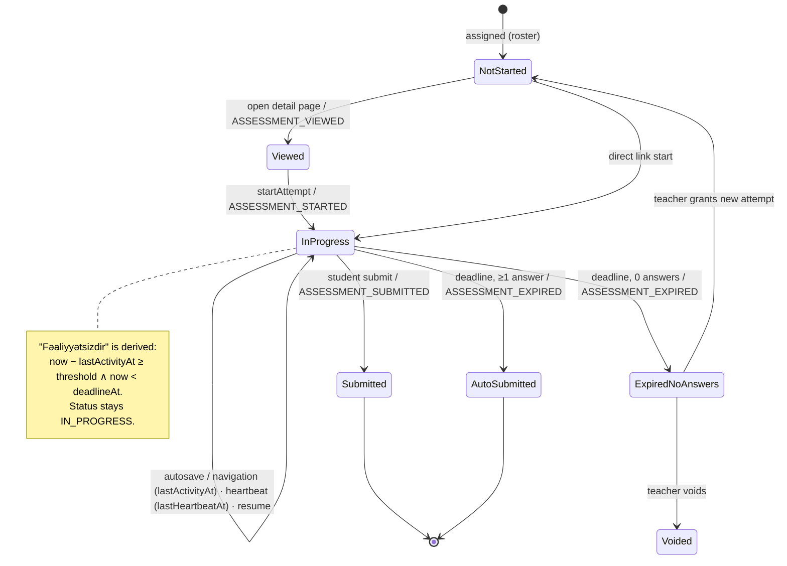

# Teacher activity, completion & engagement tracking + exam session interruption

Status: **plan — not implemented.** No schema or behaviour described here exists yet unless marked "exists".
Migration 0002 is still unapplied in production; everything below lands as a separate migration **0003**.

---

## 1. Audit of the current code (what we reuse, what is missing)

| Area | Where | State today | Consequence for this plan |
| --- | --- | --- | --- |
| Exam session | `attempts` table, `server/modules/attempts.ts` | **Exists.** One row per attempt, bound to `versionId` + `assignmentId`; `startedAt`, `deadlineAt` (server expiry), `submittedAt`; status `IN_PROGRESS / SUBMITTED / AUTO_SUBMITTED`; unique `(assessmentId, studentId, attemptNo)` | This **is** `exam_sessions`. Extend it; do **not** create a second session table. |
| Resume | `startAttempt` | **Exists.** Returns the open `IN_PROGRESS` attempt (`resumed: true`); concurrent start resolves to the same row via the unique key | Only the resume *screen* (answered/remaining) is missing. |
| Server timer | `attemptView` returns `deadlineAt` + `serverNow`; client timer is display only | **Exists** | Keep. |
| Autosave | `saveAnswers` → `INSERT … ON DUPLICATE KEY UPDATE` into `student_answers` | **Exists**, but a delayed retry can overwrite a newer answer; no activity timestamp is written | Add a per-answer revision guard and activity fields. |
| Expiry | `sweepExpiredAttempts` + lazy finalize on view/save/start | **Exists.** Always creates a result (0 % if nothing answered) | Add the `EXPIRED_NO_ANSWERS` branch (no result row). |
| Finalize | `finalizeAttempt` (row lock, idempotent, one result per attempt) | **Exists** | Reuse; hook progress/event writes into the same transaction. |
| Manual grading / release | `results.pendingReviewCount`, `visibilityForResults` | **Exists** | Grading and release states are *derived*, not session statuses. |
| Assessment "viewed" | — | **Missing** | New event + progress field. |
| Assignments, submissions | `server/resulioStore.ts` (in-memory) | **Not persisted.** Lost on restart; submission "files" are names only | Must move to MySQL before tracking (Phase 0). |
| Materials | `resulioStore.ts` (in-memory) | **Not persisted.** Only `fileName`; no stored file, no download endpoint | Phase 0: real `files` table + storage + authorized download route. |
| Notifications | `resulioStore.ts` (in-memory) | **Not persisted** | Reminders need a persistent `notifications` table (Phase 0). |
| Activity / audit log | — | **None exists** | New `student_activity_events` is justified (no table to reuse). |
| File storage | `server/storage.ts` → `storagePut`, `storageGetSignedUrl` | **Exists** (signed URLs) | Reuse for the download redirect. |

---

## 2. Design decisions

1. **`attempts` stays the session table.** Renaming it to `exam_sessions` would touch every query for no functional gain. Spec field → existing/new column:
   `user_id→studentId`, `assessment_assignment_id→assignmentId`, `assessment_version_id→versionId`, `expires_at→deadlineAt`, `started_at/submitted_at` exist.
2. **Session status stays a lifecycle status only.** Grading and release are properties of the result, not of the session, so they are derived:
   - stored: `IN_PROGRESS`, `SUBMITTED` (UI "Tamamlayıb" = spec `COMPLETED`), `AUTO_SUBMITTED` (UI "Vaxt bitib — avtomatik təqdim edildi" = spec `EXPIRED_AUTO_SUBMITTED`), **new** `EXPIRED_NO_ANSWERS`, **new** `VOIDED` (teacher "Attempt-i ləğv et"; not counted toward the attempt limit).
   - derived: `PENDING_MANUAL_GRADING` = result with `pendingReviewCount > 0`; `RESULT_RELEASED` = `visibilityForResults` says visible.
   - derived: **inactive** = `IN_PROGRESS` ∧ `now < deadlineAt` ∧ `now − lastActivityAt ≥ threshold`. Never stored, never changes the session.
   Keeping existing enum values avoids a data rewrite; labels map them to the spec wording.
3. **`inactive_since` is not stored** — it is `lastActivityAt + threshold` and would go stale the moment the threshold setting changes.
4. **Heartbeat ≠ activity.** Heartbeat (tab open, every 60 s while visible) updates `lastHeartbeatAt`. Activity (answer change, autosave, open/next/previous question, flag) updates `lastActivityAt`. Otherwise an abandoned-but-open tab would never show as inactive. Teacher sees both: "Son aktivlik: 17 dəq əvvəl · Səhifə açıqdır". Tab blur/focus is recorded only as a separate signal and never changes status.
5. **Progress rows are created lazily; roster totals come from membership.** "Assigned students" = ACTIVE `group_members` of targeted groups ∪ directly targeted students, computed at read time. Progress rows exist only once a student does something. So `NOT_OPENED = roster − rows with viewed_at`. This avoids backfilling rows whenever a student joins a group after assignment, and keeps counts correct when a student leaves.
6. **Assessment progress is unique per `(assessmentId, studentId)`**, not per assignment row: a student in two assigned groups resolves to one assignment (existing `resolveAssignment`), and `attempts` is already unique on the same pair.
7. **OVERDUE is derived at read time** (`deadline < now` ∧ not submitted). No cron needed; `overdue_at` = deadline.
8. **Events are append-only and throttled where noisy.** `ASSESSMENT_AUTOSAVED` is written at most once per attempt per 5 min (the attempt row already holds exact timestamps). Views are recorded at most once per student/entity per 30 min for the event log, while `view_count` still increments.
9. **Download = "access granted".** Internally `FILE_DOWNLOADED` means the server authorized and issued a signed URL. UI copy: "Faylı yükləyib". Never "oxuyub", "öyrənib" or "tamamlayıb" for PDFs/downloads.

---

## 3. Schema (migration 0003)

### 3.1 Changes to existing tables

```sql
ALTER TABLE attempts
  MODIFY status ENUM('IN_PROGRESS','SUBMITTED','AUTO_SUBMITTED','EXPIRED_NO_ANSWERS','VOIDED') NOT NULL DEFAULT 'IN_PROGRESS',
  ADD lastActivityAt timestamp NULL,
  ADD lastAutosaveAt timestamp NULL,
  ADD lastHeartbeatAt timestamp NULL,
  ADD answeredCount int NOT NULL DEFAULT 0,
  ADD totalQuestionCount int NOT NULL DEFAULT 0,
  ADD autoSubmittedAt timestamp NULL,
  ADD voidedBy int NULL, ADD voidedAt timestamp NULL,
  ADD INDEX attempts_assessment_status_idx (assessmentId, status);
-- backfill: totalQuestionCount = JSON_LENGTH(questionOrder); lastActivityAt = startedAt;
--           answeredCount = count of non-null student_answers

ALTER TABLE student_answers ADD revision int NOT NULL DEFAULT 0;
-- upsert only if VALUES(revision) > revision  (stale retries become no-ops)

ALTER TABLE assessments ADD inactivityThresholdMinutes int NULL DEFAULT 10;
-- 5 | 10 | 15 | 30 | NULL (= do not show inactivity). Operational setting: editable after publish, not versioned.
```

### 3.2 Phase 0 — persist what is in memory today

| Table | Key columns |
| --- | --- |
| `files` | `id`, `providerWorkspaceId`, `ownerUserId` (**"Materialı əlavə edən"** / submission author), `purpose` ENUM(MATERIAL, ASSIGNMENT_ATTACHMENT, SUBMISSION), `storageKey`, `fileName`, `mimeType`, `sizeBytes`, `createdAt` |
| `assignments` | `id`, `providerWorkspaceId`, `createdBy`, `title`, `description`, `instructions`, `deadlineAt`, `status` (ACTIVE/ARCHIVED), timestamps |
| `assignment_targets` | `assignmentId`, `groupId` NULL, `studentId` NULL |
| `assignment_submissions` | `id`, `assignmentId`, `studentId`, `revisionNo`, `status`, `submittedAt`, `isLate`, `gradedBy`, `gradedAt`, `score`, `feedback`, `returnedAt` — unique `(assignmentId, studentId, revisionNo)` |
| `submission_files` | `submissionId`, `fileId` |
| `materials` | `id`, `providerWorkspaceId`, `createdBy`, `title`, `description`, `subject`, `topic`, `fileId` NULL, `kind` (FILE/VIDEO/LINK), timestamps |
| `material_targets` | `materialId`, `groupId` NULL, `studentId` NULL |
| `notifications` | `id`, `userId`, `title`, `body`, `link`, `readAt`, `createdAt` |

### 3.3 Tracking tables

```text
student_activity_events            (append-only)
  id bigint PK auto, userId, providerWorkspaceId, groupId NULL,
  entityType ENUM(ASSESSMENT, ASSIGNMENT, MATERIAL, FILE),
  entityId varchar(64), eventType varchar(40), metadata json NULL, createdAt
  INDEX (providerWorkspaceId, entityType, entityId, createdAt)
  INDEX (userId, createdAt)

assessment_student_progress
  id, assessmentId, assignmentId, versionId NULL, studentId,
  viewedAt, startedAt, completedAt, expiredAt, resultReleasedAt, latestActivityAt,
  attemptCount, activeAttemptId NULL, createdAt, updatedAt
  UNIQUE (assessmentId, studentId); INDEX (assessmentId, latestActivityAt)

assignment_student_progress
  id, assignmentId, studentId, status,
  openedAt, startedAt, submittedAt, gradedAt, returnedAt, latestActivityAt,
  submissionCount, isLate, createdAt, updatedAt
  UNIQUE (assignmentId, studentId); INDEX (assignmentId, status)

material_student_progress
  id, materialId, studentId,
  firstViewedAt, lastViewedAt, viewCount, firstDownloadedAt, lastDownloadedAt, downloadCount,
  completedAt (video only), latestActivityAt, createdAt, updatedAt
  UNIQUE (materialId, studentId); INDEX (materialId, latestActivityAt)

reminders
  id, providerWorkspaceId, entityType, entityId, audience
  ENUM(NOT_VIEWED, STARTED_NOT_SUBMITTED, OVERDUE, NOT_STARTED),
  message, recipientIds json, sentBy, createdAt
reminder_recipients
  reminderId, studentId, INDEX (entityType, entityId, studentId, createdAt)  -- dedupe window
```

Spec deviation: progress tables are keyed by `assessmentId` / `assignmentId` / `materialId` rather than a separate "material_assignment_id", because targets are rows in `*_targets` and one student maps to one progress record per item.

---

## 4. Event lifecycle



Assignment: `NOT_OPENED → VIEWED → IN_PROGRESS (draft text or file attached) → SUBMITTED | LATE_SUBMITTED → PENDING_REVIEW → GRADED | RETURNED_FOR_REVISION → (resubmit) …`; `OVERDUE` derived.

Material: `NOT_VIEWED → VIEWED → DOWNLOADED`; video adds `IN_PROGRESS → COMPLETED` at the configured watch threshold.

Every state change runs **in one transaction**: domain write (attempt/submission) + progress upsert + event insert. Events are never the source of truth for counts.

### Download flow

```text
GET /api/files/:fileId/download   (Express route, session cookie, rate-limited)
  → load file + workspace; authorize:
      teacher: owns file's workspace
      student: file belongs to a material/assignment targeted at them (ACTIVE membership or direct)
      partner / other: 404 (do not reveal existence)
  → tx: insert FILE_DOWNLOADED (+ MATERIAL_DOWNLOADED) event; upsert material_student_progress (downloadCount+1)
  → 302 to storageGetSignedUrl(storageKey) with short TTL; Cache-Control: no-store
```

Private storage URLs are never returned in tRPC payloads.

---

## 5. Exam session interruption behaviour

| Situation | Behaviour |
| --- | --- |
| Refresh / crash / phone off / network drop, deadline not reached | Same attempt returned by `startAttempt`; answers from `student_answers`; remaining time from server `deadlineAt − serverNow`. No new attempt. |
| Student returns to the assessment page | Resume card: "Siz bu imtahana əvvəllər başlamısınız." · "Cavablandırılan suallar: 8 / 20" · "Qalan vaxt: 31 dəqiqə" · **İmtahana davam et** |
| Offline while answering | Answers queue in memory + `sessionStorage` (UX only), sent with increasing `revision` on reconnect; server keeps the highest revision. Server is the only source of truth. |
| Deadline passes, ≥1 answer | Row lock → grade saved answers → `AUTO_SUBMITTED`, `autoSubmittedAt` → result; pending manual grading if open questions. |
| Deadline passes, 0 answers | Row lock → `EXPIRED_NO_ANSWERS`, no result row (does not drag averages to 0 %). Teacher actions: **Yeni cəhd ver** (per-student `attemptLimitOverride`), **Attempt-i ləğv et** (`VOIDED`), **İmtahana yenidən dəvət et** (notification). |
| Double submit / submit racing the sweeper | Existing row lock + "already finalized → return existing result". |
| Client sends a later deadline or a status | Not accepted: no input carries either; both are server-computed. |

Teacher participant row: name · status label + icon · started at · last activity · answered / total · remaining time (if active) · submitted / auto-submitted at · result state (%, "Müəllim yoxlaması gözlənilir", "Təqdim edilməyib").

Labels: `IN_PROGRESS` "Davam edir" · derived "Fəaliyyətsizdir · Son aktivlik: X dəq əvvəl" · `SUBMITTED` "Tamamlayıb" · `AUTO_SUBMITTED` "Vaxt bitib — avtomatik təqdim edildi" · `EXPIRED_NO_ANSWERS` "Vaxt bitib — cavab təqdim edilməyib" · pending "Müəllim yoxlaması gözlənilir" · no progress "Başlamayıb".

---

## 6. Performance & indexing

- Dashboard = one grouped query per entity kind over progress tables (`GROUP BY entityId` with `SUM(viewedAt IS NOT NULL)` …) + one roster-size query per targeted group set. No event-table scans on the dashboard.
- Popovers load lazily on hover/tap (`activity.preview({kind, id})`, top N per bucket + counts), cached 30 s client-side.
- Heartbeat writes throttled server-side (skip if `lastHeartbeatAt` < 30 s old); autosave already batched by the client.
- `answeredCount` maintained inside `saveAnswers` (count after upsert) so participant lists don't aggregate `student_answers`.
- Event table: bigint PK, two composite indexes above; retention policy (e.g. 18 months, then archive) to be approved before production.

---

## 7. Authorization & privacy

| Actor | May see |
| --- | --- |
| Teacher (`teacherProcedure`, `ctx.scope`) | Progress/events only where the entity's `providerWorkspaceId = scope.workspaceId` **and** the student is on that entity's roster. Every query filters by workspace in SQL, not after fetching. |
| Student (`studentProcedure`) | Own progress, own submissions, own download history. No counts of other students, no group aggregates. |
| Partner / admin support | No engagement, activity, download or result data (no procedures expose it). |

Reminder recipients are re-validated server-side against the roster; client-supplied student ids outside it are rejected.

---

## 8. Reminders (manual only, phase 2)

Dialog shows audience, recipient count, student list and message preview → server recomputes the audience, drops students already reminded for the same entity in the last 24 h (shown as "artıq xatırladılıb"), writes `reminders` + `reminder_recipients` + `REMINDER_SENT` events + notifications in one transaction. No automated sending.

---

## 9. Implementation order

| Phase | Scope |
| --- | --- |
| **1a** (tables exist) | Migration 0003 part A: attempts activity columns, `EXPIRED_NO_ANSWERS`/`VOIDED`, answer revision guard, `inactivityThresholdMinutes`, `student_activity_events`, `assessment_student_progress`. Heartbeat + activity endpoints, resume card, teacher participants page `/teacher/assessments/:id/participants`, assessment dashboard cards. |
| **0** | Persist assignments, submissions, materials, files, notifications (replace `resulioStore`), real upload + authorized download route. |
| **1b** | Assignment + material progress tables and aggregation. |
| **2** | Dashboard cards for all kinds, hover popovers / mobile bottom sheets, `/teacher/assignments/:id/activity`, `/teacher/materials/:id/activity`, filters, manual reminders, teacher expiry actions. |
| **3** | Exports, scheduled reports, automated reminders, trends. |

Phase 1a overlaps with the recommended next task (immutable versions / session version binding): attempts are already version-bound, so the two fit in one migration.

---

## 10. Test plan

Server (vitest, real MySQL in CI or local disposable instance):
- start → leave → `startAttempt` again returns same attempt with saved answers; refresh equivalent
- stale autosave retry (lower revision) does not overwrite newer answer
- concurrent `startAttempt` creates one attempt
- save after deadline → `ATTEMPT_CLOSED`; resume after deadline finalizes instead
- sweeper: ≥1 answer → `AUTO_SUBMITTED` + result; 0 answers → `EXPIRED_NO_ANSWERS`, no result
- double submit / submit vs sweeper → one result
- inactivity derivation for thresholds 5/10/15/30/disabled; heartbeat alone does not reset inactivity
- material viewed 3× → unique viewers 1, viewCount 3; download increments downloadCount
- unauthorized student / other workspace teacher / partner → download 404, no event written
- teacher sees only own-workspace activity; student cannot read other students' progress
- overdue and late-submission derivation around the deadline
- reminder logged; second reminder inside 24 h skipped
- dashboard counts equal detailed report counts for the same fixture

UI (browser smoke): resume card after reload, hover popover (desktop), tap bottom sheet (mobile), inactive/active/expired labels with icon + text in light and dark mode.

---

## 11. Phase 1a status

Implemented: `drizzle/0003_activity_tracking.sql` (generated by drizzle-kit, plus a hand-written backfill of `totalQuestionCount`, `lastActivityAt`, `answeredCount`, `autoSubmittedAt` and one `assessment_student_progress` row per student/assessment from existing attempts), snapshot `0003` (prevId = 0002 id), journal entry.

Verified without a database:
- `pnpm db:verify` replays 0000–0003 into a schema model and compares it with the latest snapshot (the `_legacy_user_roles_0002` backup table and data statements are ignored). A mutated copy (dropped index, changed nullability) is reported as a mismatch.
- `drizzle-kit generate` → no schema changes; `drizzle-kit check` → OK.

Not yet verified: the SQL has not been executed against any MySQL (no local instance). 0003 depends on 0002 and must be applied after it; neither is to be run on live MySQL yet. On production both would run together, so the 0003 backfill touches zero attempts there.

Covered by unit tests (`server/activity.test.ts`, `server/security.test.ts`): inactivity for 5/10/15/30/disabled, heartbeat does not reset inactivity, participant states, voided attempts excluded from limits and reports, dashboard summary counts equal report rows, average excludes no-answer students, new endpoints reject anonymous users and users without an owned workspace, threshold and revision validation, ping rate limit.

Still needs a real MySQL (DB-backed tests above): revision guard SQL, concurrent start, sweeper paths, cross-workspace teacher access to `participants`.
